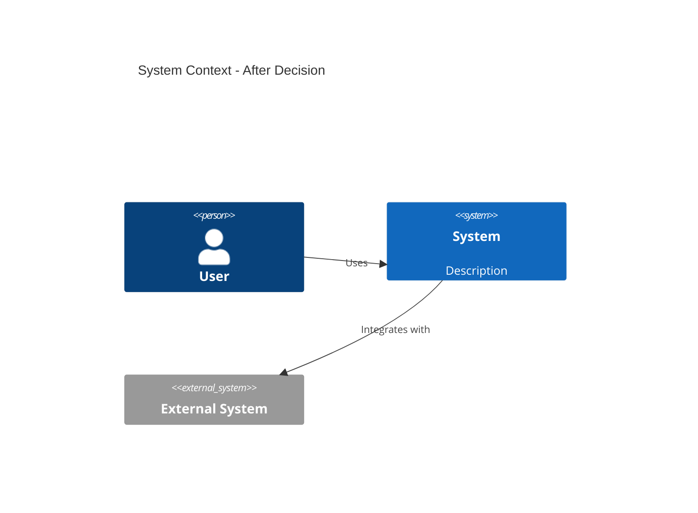
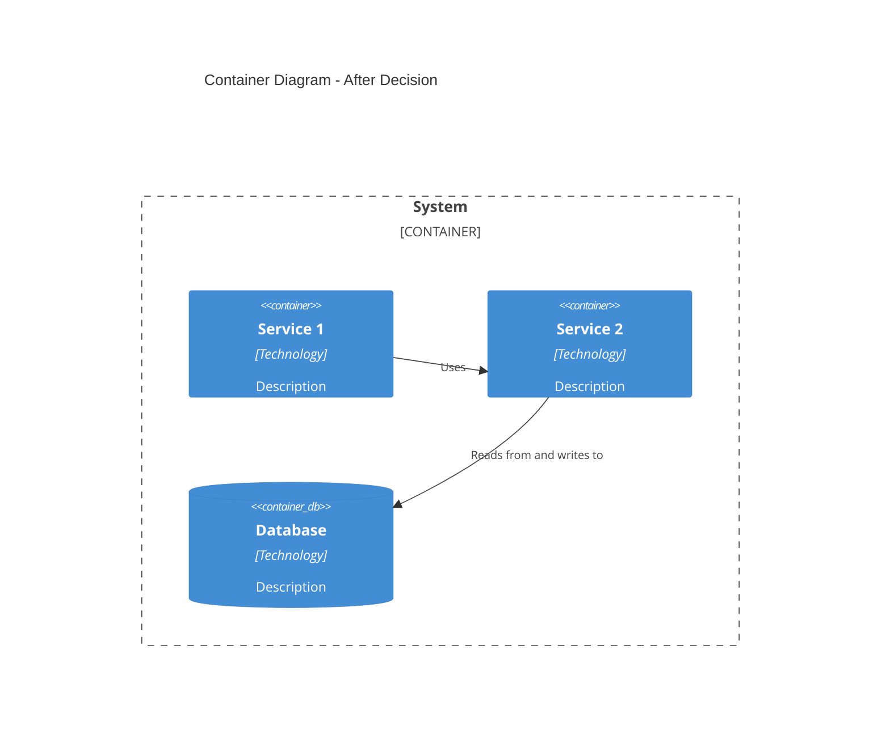
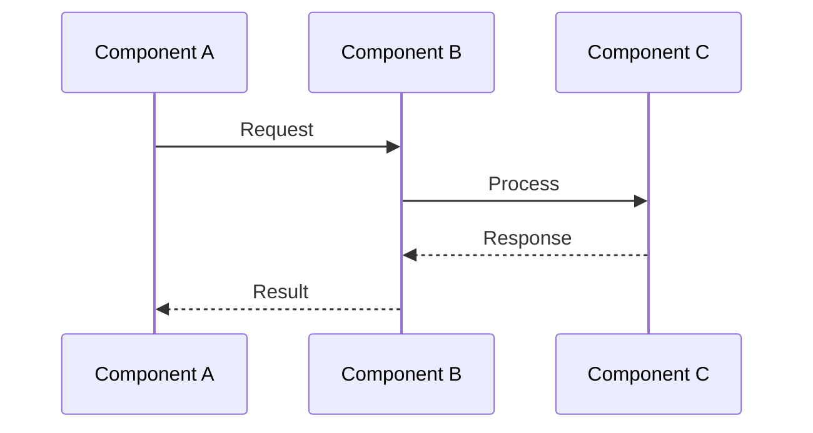
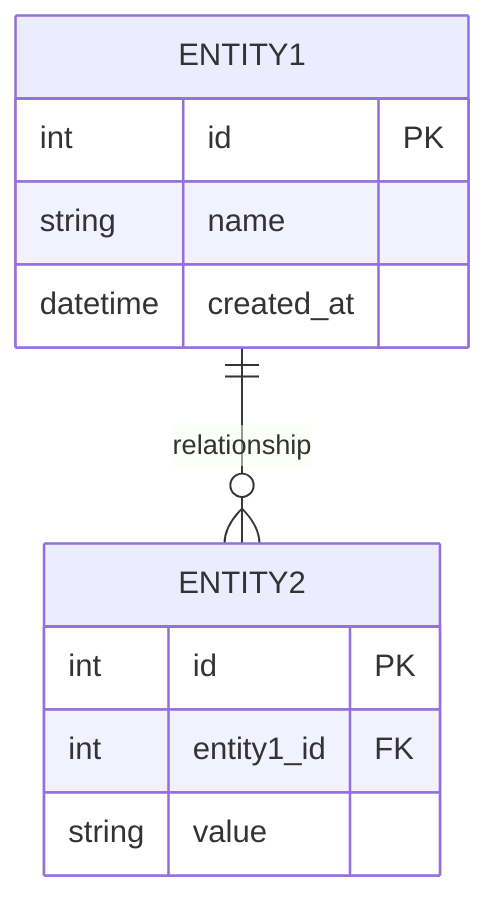

# ADR Template

> **Purpose**: Lightweight template for Architecture Decision Records (ADR)  
> **Format**: Markdown  
> **Version**: 1.0 (2026)

---

## ADR-XXX: [Short Title of the Decision]

**Status**: [Proposed | Accepted | Deprecated | Superseded]  
**Date**: YYYY-MM-DD  
**Deciders**: [Names or roles of decision makers]  
**Tags**: [technology, pattern, service, etc.]

---

## Context

**What is the issue or problem we're facing?**

Describe the situation, constraints, and requirements that led to this decision. Include:
- Business or technical problem
- Current state and limitations
- Requirements that must be addressed
- Any constraints (time, budget, technology, team skills)

**Example:**
> We need to handle 1 million concurrent users with sub-5 second response times. Our current monolithic architecture cannot scale horizontally and deployment of one feature requires redeploying the entire system.

---

## Decision

**What did we decide?**

State the decision clearly and concisely. Be specific about what technology, pattern, or approach was chosen.

**Example:**
> We will adopt a microservices architecture with service boundaries based on business capabilities. Each service will be independently deployable and scalable.

---

## Considered Options

**What alternatives did we consider?**

List the options that were evaluated, with brief pros and cons for each.

### Option 1: [Name of Option]

**Pros:**
- Advantage 1
- Advantage 2

**Cons:**
- Disadvantage 1
- Disadvantage 2

### Option 2: [Name of Option]

**Pros:**
- Advantage 1
- Advantage 2

**Cons:**
- Disadvantage 1
- Disadvantage 2

### Option 3: [Name of Option] (if applicable)

**Pros:**
- Advantage 1

**Cons:**
- Disadvantage 1

---

## Decision Outcome

**Why did we choose this option?**

Explain the rationale for selecting this option over the alternatives. Reference specific requirements, constraints, or evaluation criteria.

**Example:**
> We chose microservices because it enables independent scaling of services based on load, allows technology diversity (Go for performance-critical services, Node.js for real-time services), and supports faster deployment cycles. While it increases operational complexity, the benefits outweigh the costs for our scale and requirements.

---

## Consequences

**What are the positive and negative impacts of this decision?**

### Positive

- Benefit 1
- Benefit 2
- Benefit 3

### Negative

- Trade-off 1
- Trade-off 2
- Trade-off 3

### Neutral / Notes

- Additional consideration 1
- Future implications 2

---

## Architecture Impact (Optional)

**Use this section when the decision significantly changes the system architecture.**

### Context Diagram Changes

**Does this decision change the System Context?** (Optional)

If this decision adds, removes, or modifies external systems or actors, describe the changes here.

**Changes:**
- Added/removed/modified: [Description]

### Container Diagram Changes

**Does this decision change the Container/Logical View?** (Optional)

If this decision adds, removes, or modifies containers (services, databases, etc.), show the changes here.

**Changes:**
- Added container: [Service/Database name] - [Reason]
- Removed container: [Service/Database name] - [Reason]
- Modified container: [Service/Database name] - [Changes]

### Logical Flow Changes

**Does this decision change the data flow or process flow?** (Optional)

If this decision changes how data or requests flow through the system, document it here.

**Changes:**
- Modified flow: [Description of change]
- New flow: [Description]

---

## Data Model Impact (Optional)

**Use this section when the decision affects the database schema or data model.**

### ERD Changes

**Does this decision change the Entity Relationship Diagram?** (Optional)

If this decision adds, removes, or modifies database tables, columns, or relationships, document it here.

**Changes:**
- **New Tables**: [Table name] - [Purpose]
- **Modified Tables**: 
  - [Table name]: Added columns [list], Removed columns [list]
- **New Relationships**: [Description]
- **Modified Relationships**: [Description]

### Schema Migration Notes

- Migration script location: [Path]
- Data migration required: Yes/No
- Rollback strategy: [Description]

---

## Security Impact (Optional)

**Use this section when the decision has security implications.**

### Security Analysis

**What security concerns were analyzed?**

- **Threat**: [Description of security threat]
  - **Risk Level**: [High | Medium | Low]
  - **Mitigation**: [How it's addressed]

- **Threat**: [Description]
  - **Risk Level**: [High | Medium | Low]
  - **Mitigation**: [How it's addressed]

### Security Measures

**What security measures are implemented or required?**

- Authentication/Authorization changes: [Description]
- Data encryption: [Description]
- Network security: [Description]
- Compliance requirements: [PCI DSS, GDPR, etc.]
- Security testing: [Required tests]

### Security Trade-offs

- **Positive**: [Security improvements]
- **Negative**: [Security concerns or limitations]

---

## Performance Impact (Optional)

**Use this section when the decision affects system performance.**

### Performance Analysis

**How does this decision affect performance?**

- **Latency**: [Impact on response time]
  - Before: [Baseline]
  - After: [Expected]
  - Change: [Improvement/Degradation]

- **Throughput**: [Impact on requests per second]
  - Before: [Baseline]
  - After: [Expected]
  - Change: [Improvement/Degradation]

- **Resource Usage**: [CPU, Memory, Network]
  - Before: [Baseline]
  - After: [Expected]
  - Change: [Increase/Decrease]

### Performance Optimizations

**What optimizations are implemented or planned?**

- Caching strategy: [Description]
- Database optimization: [Description]
- Network optimization: [Description]
- Load balancing: [Description]

### Performance Monitoring

**What metrics will be monitored?**

- Key metrics: [List]
- Alert thresholds: [Description]
- Performance testing: [Required tests]

---

## Dependencies & Libraries (Optional)

**Use this section when the decision introduces new dependencies or libraries.**

### New Dependencies

**What new dependencies or libraries are introduced?**

| Dependency | Version | Purpose | License |
|------------|---------|---------|---------|
| library-name | 1.0.0 | Purpose | MIT/Apache/etc. |
| framework-name | 2.0.0 | Purpose | License |

### Dependency Management

- Package manager: [npm, Maven, Go modules, etc.]
- Version pinning strategy: [Exact, Range, Latest]
- Update policy: [How dependencies will be updated]

### Dependency Risks

- **Security**: [Known vulnerabilities, update frequency]
- **Maintenance**: [Active maintenance, community support]
- **License**: [License compatibility, legal concerns]
- **Size**: [Impact on bundle size, startup time]

---

## Deployment Impact (Optional)

**Use this section when the decision affects deployment or infrastructure.**

### Infrastructure Changes

**What infrastructure changes are required?**

- **New Services**: [List of new services/components]
- **Modified Services**: [List of modified services]
- **Removed Services**: [List of removed services]
- **Configuration Changes**: [Environment variables, config files]

### Deployment Process Changes

**How does deployment change?**

- **Before**: [Current deployment process]
- **After**: [New deployment process]
- **Migration Steps**: [Steps to migrate]

### Deployment Considerations

- **Rollback Strategy**: [How to rollback if needed]
- **Zero-Downtime**: [Is zero-downtime deployment possible?]
- **Database Migrations**: [Required migrations]
- **Feature Flags**: [Required feature flags]
- **Monitoring**: [New monitoring requirements]

### Infrastructure Requirements

- **Compute**: [CPU, Memory requirements]
- **Storage**: [Storage requirements]
- **Network**: [Network requirements, bandwidth]
- **Third-party Services**: [External services needed]

---

## Implementation Notes

**How will we implement this decision?** (Optional)

- Step 1 or guideline
- Step 2 or guideline
- Reference to related documentation

---

## References

- [Link to related ADR](#)
- [External resource or documentation](#)
- [Related decision or pattern](#)

---

## Notes

**Additional context, follow-up decisions, or changes** (Optional)

- Note 1
- Note 2

---

**Last Updated**: YYYY-MM-DD  
**Related ADRs**: [ADR-XXX](#), [ADR-YYY](#)
