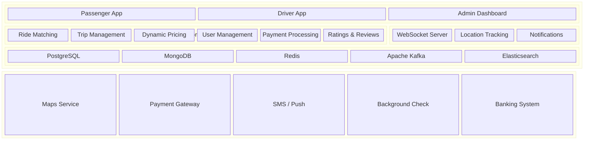
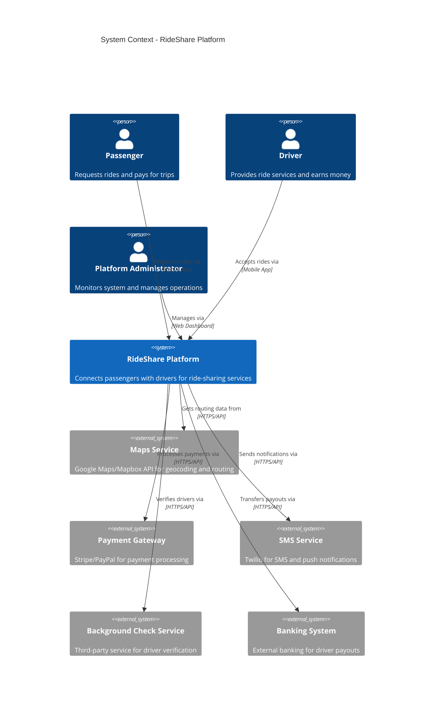
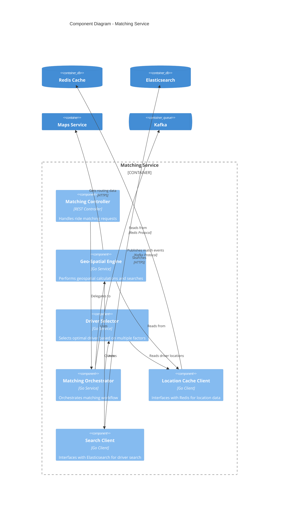
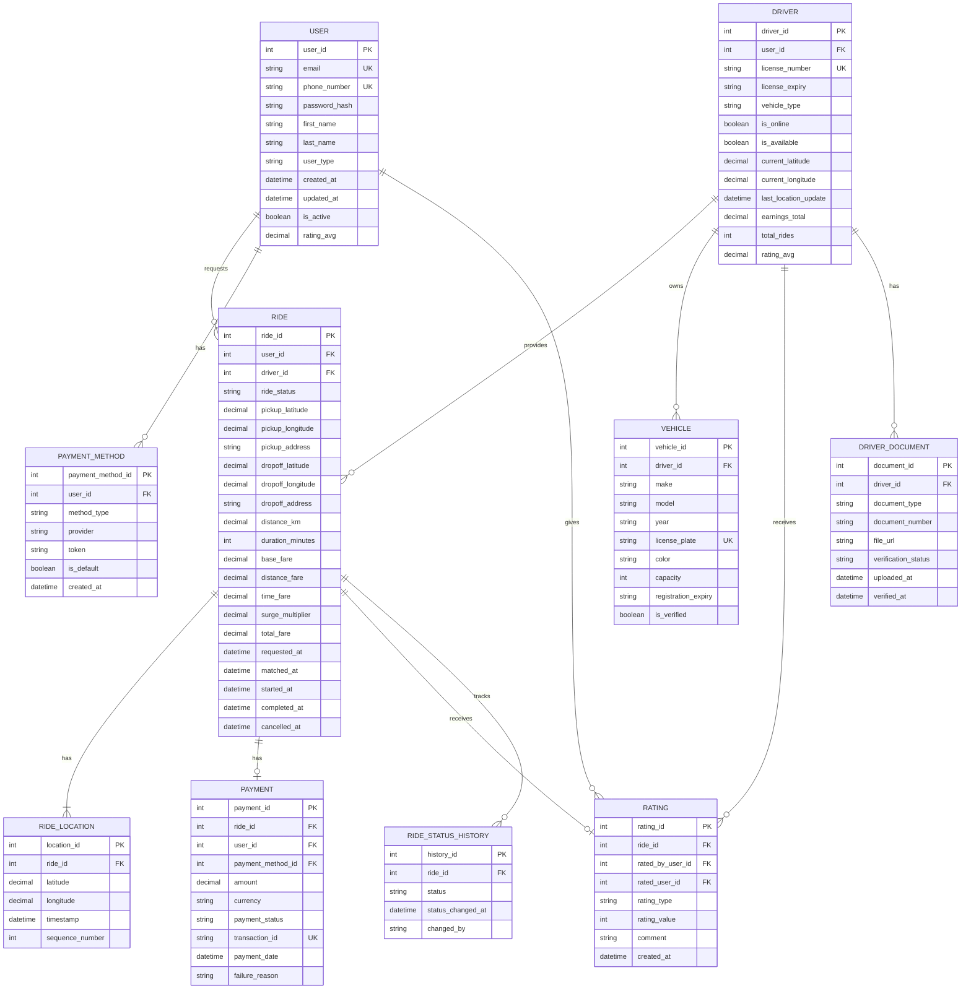
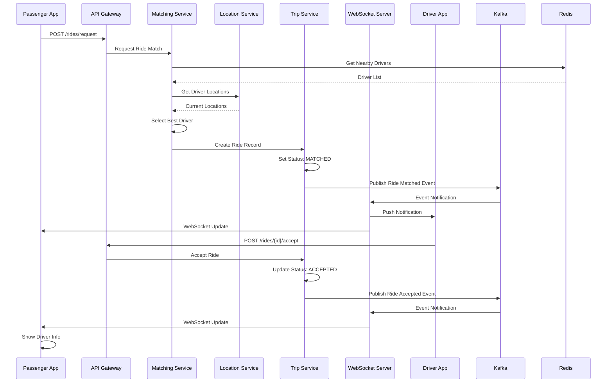
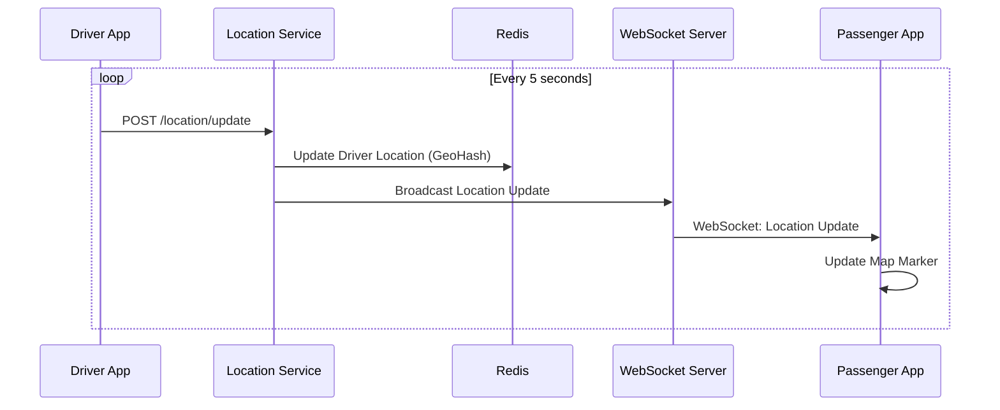
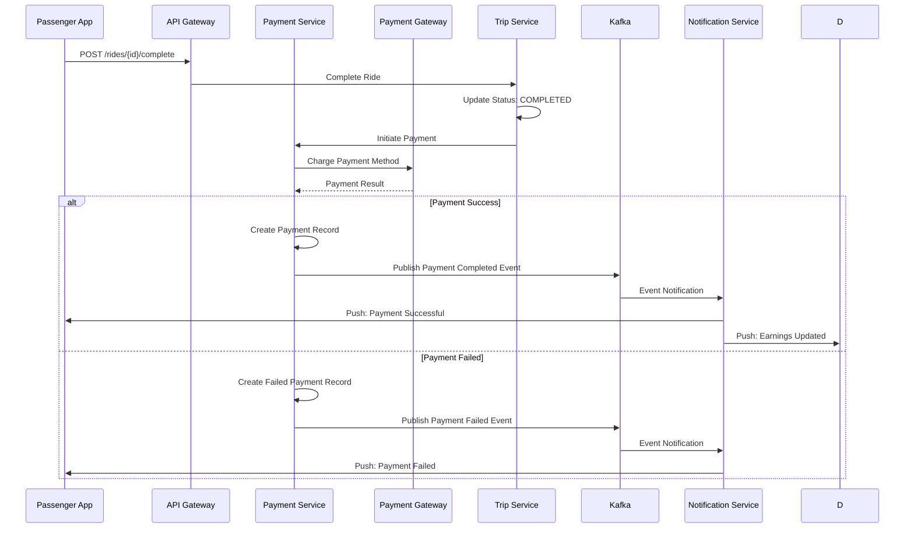

# Solution Architecture Document (SAD) - RideShare Platform

> **Version:** 1.0  
> **Last Updated:** 2026-01-26  
> **System:** RideShare Platform (Uber-like Ride-Sharing Service)  
> **Purpose:** Complete architecture documentation for a ride-sharing platform

---

## Table of Contents

1. [Executive Summary](#1-executive-summary)
2. [Architecture Vision](#2-architecture-vision)
3. [Business Requirements](#3-business-requirements)
4. [Technology Baseline](#4-technology-baseline)
5. [System Landscape](#5-system-landscape)
6. [Logical View](#6-logical-view)
7. [Component View (C4 Level 3)](#7-component-view-c4-level-3)
8. [Deployment View (C4 Level 4)](#8-deployment-view-c4-level-4)
9. [Data Architecture & ERD](#9-data-architecture--erd)
10. [Integration & Data Flow](#10-integration--data-flow)
11. [Security Architecture](#11-security-architecture)
12. [Non-Functional Requirements](#12-non-functional-requirements)
13. [Architectural Decisions](#13-architectural-decisions)
14. [Risks & Mitigation](#14-risks--mitigation)

---

## 1. Executive Summary

### 1.1 Purpose
This document describes the architecture of RideShare Platform, a ride-sharing service that connects passengers with drivers in real-time. The platform enables users to request rides, track drivers, process payments, and rate experiences through mobile applications and web interfaces.

### 1.2 Scope
**In Scope:**
- Passenger and driver mobile applications
- Real-time ride matching and tracking
- Payment processing and driver payouts
- Rating and review system
- Admin dashboard for operations
- Driver onboarding and verification

**Out of Scope:**
- Vehicle maintenance scheduling
- Insurance management
- Driver background check services (handled by third-party)
- Food delivery services

### 1.3 Key Objectives
- Enable real-time ride matching with sub-5 second response time
- Support 1 million concurrent users across multiple cities
- Process 100,000 rides per day with 99.9% uptime
- Provide seamless payment experience with multiple payment methods
- Ensure driver and passenger safety through real-time tracking

### 1.4 Success Criteria
- Average ride matching time < 5 seconds
- System availability > 99.9%
- Payment success rate > 99.5%
- User satisfaction rating > 4.5/5.0
- Zero data breaches in first year

---

## 2. Architecture Vision

### 2.1 Vision Statement
To create a scalable, reliable, and secure ride-sharing platform that provides seamless transportation services while maintaining excellent user experience, real-time responsiveness, and operational efficiency.

### 2.2 Architecture Principles
- **Microservices First**: Decompose system into independent, scalable services
- **Event-Driven**: Use asynchronous messaging for loose coupling and scalability
- **Cloud-Native**: Leverage cloud services for elasticity and global reach
- **Real-Time First**: Optimize for low-latency user interactions
- **Security by Design**: Implement security at every layer
- **Observability**: Comprehensive logging, monitoring, and tracing

### 2.3 Constraints & Assumptions
**Constraints:**
- Must comply with local transportation regulations
- Payment processing must meet PCI DSS requirements
- Real-time location tracking requires continuous GPS updates
- Multi-region deployment for global availability

**Assumptions:**
- Users have smartphones with GPS capabilities
- Stable internet connectivity for drivers and passengers
- Third-party payment gateways are available and reliable
- Map services (Google Maps/Mapbox) provide accurate routing

---

## 3. Business Requirements

### 3.1 Business Problem
Traditional taxi services suffer from inefficiencies including long wait times, lack of transparency in pricing, and poor user experience. The RideShare platform addresses these issues by providing:
- Real-time driver availability and matching
- Transparent, dynamic pricing
- Seamless payment processing
- Rating and feedback system
- Improved safety through real-time tracking

### 3.2 Business Objectives
- Capture 20% market share in target cities within first year
- Achieve $50M annual revenue by end of year 2
- Maintain driver retention rate > 80%
- Achieve customer satisfaction score > 4.5/5.0
- Expand to 50 cities within 3 years

### 3.3 Stakeholders
| Stakeholder | Role | Concerns |
|------------|------|----------|
| Passengers | End Users | Fast matching, fair pricing, safety, payment security |
| Drivers | Service Providers | Fair earnings, reliable app, quick ride requests |
| Operations Team | Internal | System reliability, driver management, analytics |
| Finance Team | Internal | Payment processing, revenue tracking, fraud prevention |
| Compliance Team | Internal | Regulatory compliance, data privacy, safety standards |
| Investors | External | Scalability, growth metrics, profitability |

### 3.4 Functional Requirements
- **FR-1**: Passengers can request rides by specifying pickup and drop-off locations
- **FR-2**: System matches passengers with nearest available drivers in real-time
- **FR-3**: Real-time tracking of driver location and ETA
- **FR-4**: Dynamic pricing based on demand, distance, and time
- **FR-5**: Multiple payment methods (credit card, digital wallet, cash)
- **FR-6**: Rating and review system for both drivers and passengers
- **FR-7**: Driver onboarding with document verification
- **FR-8**: Trip history and receipts for passengers
- **FR-9**: Driver earnings dashboard and payout management
- **FR-10**: Admin dashboard for monitoring and operations

---

## 4. Technology Baseline

### 4.1 Current State
The platform is being built from scratch with no existing legacy systems. The architecture will be cloud-native from day one, leveraging modern microservices patterns and containerization.

### 4.2 Technology Stack
- **Frontend Mobile**: React Native (iOS & Android)
- **Frontend Web**: React.js with TypeScript
- **API Gateway**: Kong / AWS API Gateway
- **Backend Services**: 
  - Node.js (TypeScript) for real-time services
  - Go for high-performance services (matching, pricing)
  - Java (Spring Boot) for transactional services
- **Real-Time Communication**: WebSocket (Socket.io), Server-Sent Events
- **Message Queue**: Apache Kafka for event streaming
- **Database**: 
  - PostgreSQL for transactional data
  - MongoDB for document storage (driver profiles, trip history)
  - Redis for caching and real-time location tracking
- **Search & Matching**: Elasticsearch for driver search
- **Geospatial**: PostGIS extension for PostgreSQL, Redis GeoHash
- **Infrastructure**: AWS (EC2, ECS, RDS, ElastiCache, S3)
- **Monitoring**: Prometheus, Grafana, ELK Stack
- **CI/CD**: GitHub Actions, Docker, Kubernetes

### 4.3 Dependencies
- **Google Maps API / Mapbox**: Geocoding, routing, and map display
- **Stripe / PayPal**: Payment processing
- **Twilio**: SMS and push notifications
- **AWS S3**: Document storage (driver licenses, vehicle registration)
- **Third-party Background Check Service**: Driver verification

---

## 5. System Landscape

### 5.1 Solution Landscape

High-level overview of capability domains and application groupings for the RideShare platform.

#### 5.1.1 Domain Descriptions
| Domain | Description |
|--------|-------------|
| Client Applications | Mobile apps for passengers and drivers, web dashboard for operations |
| Core Platform Services | Business logic: matching, trips, pricing, payments, ratings |
| Real-Time Layer | WebSocket server, live location tracking, push notifications |
| Data & Messaging | Persistence (PostgreSQL, MongoDB), caching (Redis), event streaming (Kafka), search (Elasticsearch) |
| External Services | Third-party integrations outside platform boundary |

---

### 5.2 Context Diagram (C4 Level 1)

The Context Diagram shows how the RideShare platform interacts with users and external systems.

#### 5.2.1 System Description
The RideShare Platform is a comprehensive ride-sharing service that enables passengers to request rides from nearby drivers. The system handles real-time matching, location tracking, dynamic pricing, payment processing, and provides a rating system for quality assurance.

#### 5.2.2 External Systems
- **Maps Service**: Provides geocoding, reverse geocoding, route calculation, and map visualization
- **Payment Gateway**: Handles credit card processing, digital wallet payments, and secure transaction management
- **SMS Service**: Sends SMS notifications and push notifications to mobile devices
- **Background Check Service**: Performs driver background verification and document validation
- **Banking System**: Processes driver payouts and handles financial transactions

---

## 6. Logical View

The Container diagram shows the high-level technical building blocks of the RideShare platform.

```mermaid
C4Container
    title Container Diagram - Logical View
    
    Person(passenger, "Passenger")
    Person(driver, "Driver")
    Person(admin, "Administrator")
    
    Container_Boundary(mobile, "Mobile Applications") {
        Container(passengerApp, "Passenger App", "React Native", "iOS and Android app for passengers")
        Container(driverApp, "Driver App", "React Native", "iOS and Android app for drivers")
    }
    
    Container_Boundary(web, "Web Applications") {
        Container(adminDashboard, "Admin Dashboard", "React, TypeScript", "Web interface for operations team")
    }
    
    Container_Boundary(api, "API Layer") {
        Container(apiGateway, "API Gateway", "Kong/AWS API Gateway", "Routes requests and handles authentication")
    }
    
    Container_Boundary(services, "Backend Services") {
        Container(userService, "User Service", "Node.js", "Manages user accounts and profiles")
        Container(matchingService, "Matching Service", "Go", "Matches passengers with drivers using geospatial algorithms")
        Container(tripService, "Trip Service", "Java, Spring Boot", "Manages ride lifecycle and state")
        Container(pricingService, "Pricing Service", "Go", "Calculates dynamic pricing and surge pricing")
        Container(paymentService, "Payment Service", "Java, Spring Boot", "Processes payments and payouts")
        Container(notificationService, "Notification Service", "Node.js", "Sends real-time notifications")
        Container(locationService, "Location Service", "Go", "Tracks and updates real-time locations")
        Container(ratingService, "Rating Service", "Node.js", "Manages ratings and reviews")
    }
    
    Container_Boundary(realtime, "Real-Time Layer") {
        Container(websocket, "WebSocket Server", "Socket.io, Node.js", "Handles real-time bidirectional communication")
    }
    
    Container_Boundary(data, "Data Layer") {
        ContainerDb(userDb, "User Database", "PostgreSQL", "Stores user accounts and profiles")
        ContainerDb(tripDb, "Trip Database", "PostgreSQL", "Stores trip data and history")
        ContainerDb(driverDb, "Driver Database", "MongoDB", "Stores driver profiles and documents")
        ContainerDb(cache, "Cache", "Redis", "Caches frequently accessed data and real-time locations")
        ContainerDb(search, "Search Engine", "Elasticsearch", "Indexes drivers for fast geospatial search")
    }
    
    Container_Boundary(messaging, "Messaging Layer") {
        ContainerQueue(kafka, "Event Stream", "Apache Kafka", "Handles event-driven communication between services")
    }
    
    System_Ext(maps, "Maps Service")
    System_Ext(paymentGateway, "Payment Gateway")
    System_Ext(sms, "SMS Service")
    
    Rel(passenger, passengerApp, "Uses")
    Rel(driver, driverApp, "Uses")
    Rel(admin, adminDashboard, "Uses")
    Rel(passengerApp, apiGateway, "Makes API calls to", "HTTPS")
    Rel(driverApp, apiGateway, "Makes API calls to", "HTTPS")
    Rel(adminDashboard, apiGateway, "Makes API calls to", "HTTPS")
    Rel(passengerApp, websocket, "Connects via", "WebSocket")
    Rel(driverApp, websocket, "Connects via", "WebSocket")
    Rel(apiGateway, userService, "Routes to", "HTTPS")
    Rel(apiGateway, matchingService, "Routes to", "HTTPS")
    Rel(apiGateway, tripService, "Routes to", "HTTPS")
    Rel(apiGateway, pricingService, "Routes to", "HTTPS")
    Rel(apiGateway, paymentService, "Routes to", "HTTPS")
    Rel(apiGateway, notificationService, "Routes to", "HTTPS")
    Rel(apiGateway, locationService, "Routes to", "HTTPS")
    Rel(apiGateway, ratingService, "Routes to", "HTTPS")
    Rel(matchingService, search, "Queries", "HTTPS")
    Rel(matchingService, cache, "Reads locations from", "Redis Protocol")
    Rel(locationService, cache, "Updates locations in", "Redis Protocol")
    Rel(tripService, tripDb, "Reads from and writes to", "JDBC")
    Rel(userService, userDb, "Reads from and writes to", "JDBC")
    Rel(paymentService, paymentGateway, "Processes payments via", "HTTPS")
    Rel(matchingService, maps, "Gets routing data from", "HTTPS")
    Rel(notificationService, sms, "Sends notifications via", "HTTPS")
    Rel(tripService, kafka, "Publishes events to", "Kafka Protocol")
    Rel(paymentService, kafka, "Publishes events to", "Kafka Protocol")
    Rel(websocket, kafka, "Subscribes to events from", "Kafka Protocol")
```

### 6.1 Container Descriptions

#### 6.1.1 Mobile Applications
- **Passenger App**: React Native application for iOS and Android. Handles ride requests, real-time tracking, payment, and rating.
- **Driver App**: React Native application for drivers. Manages ride acceptance, navigation, earnings, and availability status.

#### 6.1.2 Web Applications
- **Admin Dashboard**: React-based web application for operations team to monitor system health, manage drivers, view analytics, and handle support requests.

#### 6.1.3 API Gateway
- **Technology**: Kong or AWS API Gateway
- **Purpose**: Single entry point for all API requests
- **Responsibilities**:
  - Request routing and load balancing
  - Authentication and authorization
  - Rate limiting and throttling
  - API versioning
  - Request/response transformation

#### 6.1.4 Backend Services

**User Service** (Node.js)
- Manages user accounts (passengers and drivers)
- Handles authentication and authorization
- Profile management and preferences

**Matching Service** (Go)
- Real-time driver-passenger matching using geospatial algorithms
- Considers distance, driver rating, and availability
- Optimized for low-latency (< 5 seconds)

**Trip Service** (Java, Spring Boot)
- Manages complete ride lifecycle (requested → matched → in-progress → completed)
- State machine for trip status transitions
- Trip history and receipts

**Pricing Service** (Go)
- Calculates base fare, distance-based pricing, time-based pricing
- Implements surge pricing based on demand
- Handles promotional discounts

**Payment Service** (Java, Spring Boot)
- Processes passenger payments
- Manages driver payouts
- Handles refunds and disputes
- PCI DSS compliant

**Notification Service** (Node.js)
- Sends push notifications, SMS, and in-app notifications
- Real-time updates for ride status changes
- Marketing and promotional messages

**Location Service** (Go)
- Tracks real-time GPS locations of drivers
- Updates location cache in Redis
- Calculates ETAs and distances

**Rating Service** (Node.js)
- Manages ratings and reviews
- Calculates average ratings
- Handles rating disputes

#### 6.1.5 Real-Time Layer
- **WebSocket Server**: Handles bidirectional real-time communication for location updates, ride status changes, and notifications

#### 6.1.6 Data Layer
- **User Database**: PostgreSQL for transactional user data
- **Trip Database**: PostgreSQL for trip records and history
- **Driver Database**: MongoDB for flexible driver profile documents
- **Cache**: Redis for frequently accessed data and real-time location tracking
- **Search Engine**: Elasticsearch for fast geospatial driver search

#### 6.1.7 Messaging Layer
- **Event Stream**: Apache Kafka for event-driven communication, ensuring loose coupling between services

---

## 7. Component View (C4 Level 3)

The Component diagram shows the internal structure of the Matching Service, which is one of the most critical services.

### 7.1 Component Descriptions

#### 7.1.1 Matching Controller
- Handles HTTP requests for ride matching
- Validates request parameters
- Returns matching results

#### 7.1.2 Geo-Spatial Engine
- Calculates distances using Haversine formula
- Performs radius-based searches
- Interfaces with Maps API for accurate routing

#### 7.1.3 Driver Selector
- Implements matching algorithm considering:
  - Distance to pickup location
  - Driver rating
  - Driver availability status
  - Current trip status
- Returns ranked list of available drivers

#### 7.1.4 Matching Orchestrator
- Coordinates the matching workflow
- Manages timeout and retry logic
- Publishes matching events to Kafka

---

## 8. Deployment View (C4 Level 4)

The Deployment diagram shows how containers are deployed across cloud infrastructure.

```mermaid
C4Deployment
    title Deployment Diagram - RideShare Platform
    
    Deployment_Node(aws, "AWS Cloud", "Multi-Region") {
        Deployment_Node(region1, "Region 1 (US-East)", "Primary Region") {
            Deployment_Node(mobileCdn, "CDN", "CloudFront") {
                Container(mobileApp1, "Mobile App Distribution", "React Native")
            }
            
            Deployment_Node(webTier, "Web Tier", "Load Balanced") {
                Container(adminWeb1, "Admin Dashboard Instance 1", "React")
                Container(adminWeb2, "Admin Dashboard Instance 2", "React")
            }
            
            Deployment_Node(apiTier, "API Tier", "Load Balanced") {
                Container(apiGw1, "API Gateway Instance 1", "Kong")
                Container(apiGw2, "API Gateway Instance 2", "Kong")
            }
            
            Deployment_Node(appTier, "Application Tier", "ECS/Kubernetes") {
                Container(userSvc1, "User Service Instance 1", "Node.js")
                Container(userSvc2, "User Service Instance 2", "Node.js")
                Container(matchingSvc1, "Matching Service Instance 1", "Go")
                Container(matchingSvc2, "Matching Service Instance 2", "Go")
                Container(tripSvc1, "Trip Service Instance 1", "Spring Boot")
                Container(tripSvc2, "Trip Service Instance 2", "Spring Boot")
                Container(pricingSvc1, "Pricing Service Instance 1", "Go")
                Container(pricingSvc2, "Pricing Service Instance 2", "Go")
                Container(paymentSvc1, "Payment Service Instance 1", "Spring Boot")
                Container(paymentSvc2, "Payment Service Instance 2", "Spring Boot")
                Container(notifSvc1, "Notification Service Instance 1", "Node.js")
                Container(notifSvc2, "Notification Service Instance 2", "Node.js")
                Container(locationSvc1, "Location Service Instance 1", "Go")
                Container(locationSvc2, "Location Service Instance 2", "Go")
            }
            
            Deployment_Node(realtimeTier, "Real-Time Tier", "Auto-Scaled") {
                Container(ws1, "WebSocket Server Instance 1", "Socket.io")
                Container(ws2, "WebSocket Server Instance 2", "Socket.io")
                Container(ws3, "WebSocket Server Instance 3", "Socket.io")
            }
            
            Deployment_Node(dataTier, "Data Tier") {
                ContainerDb_Ext(userDbPrimary, "User DB Primary", "PostgreSQL RDS", "Master")
                ContainerDb_Ext(userDbReplica, "User DB Replica", "PostgreSQL RDS", "Read Replica")
                ContainerDb_Ext(tripDbPrimary, "Trip DB Primary", "PostgreSQL RDS", "Master")
                ContainerDb_Ext(tripDbReplica, "Trip DB Replica", "PostgreSQL RDS", "Read Replica")
                ContainerDb_Ext(driverDb, "Driver DB Cluster", "MongoDB Atlas", "Replica Set")
                ContainerDb_Ext(redisCluster, "Redis Cluster", "ElastiCache", "Primary + Replicas")
                ContainerDb_Ext(esCluster, "Elasticsearch Cluster", "AWS Elasticsearch", "Multi-node")
            }
            
            Deployment_Node(messagingTier, "Messaging Tier") {
                ContainerQueue(kafkaCluster, "Kafka Cluster", "MSK", "3 Brokers")
            }
        }
        
        Deployment_Node(region2, "Region 2 (EU-West)", "Secondary Region") {
            Deployment_Node(appTier2, "Application Tier", "ECS/Kubernetes") {
                Container(matchingSvc3, "Matching Service Instance", "Go")
                Container(tripSvc3, "Trip Service Instance", "Spring Boot")
            }
            Deployment_Node(dataTier2, "Data Tier") {
                ContainerDb_Ext(tripDbReplica2, "Trip DB Replica", "PostgreSQL RDS", "Read Replica")
                ContainerDb_Ext(redisCluster2, "Redis Cluster", "ElastiCache", "Replica")
            }
        }
    }
    
    System_Ext(maps, "Maps Service", "Google Maps/Mapbox")
    System_Ext(paymentGateway, "Payment Gateway", "Stripe")
    System_Ext(sms, "SMS Service", "Twilio")
    
    Rel(adminWeb1, apiGw1, "HTTPS")
    Rel(adminWeb2, apiGw2, "HTTPS")
    Rel(apiGw1, userSvc1, "HTTPS")
    Rel(apiGw2, userSvc2, "HTTPS")
    Rel(apiGw1, matchingSvc1, "HTTPS")
    Rel(apiGw2, matchingSvc2, "HTTPS")
    Rel(matchingSvc1, redisCluster, "Redis Protocol")
    Rel(matchingSvc2, redisCluster, "Redis Protocol")
    Rel(matchingSvc1, esCluster, "HTTPS")
    Rel(matchingSvc2, esCluster, "HTTPS")
    Rel(tripSvc1, tripDbPrimary, "JDBC")
    Rel(tripSvc2, tripDbPrimary, "JDBC")
    Rel(tripSvc1, tripDbReplica, "JDBC (Read)")
    Rel(tripSvc2, tripDbReplica, "JDBC (Read)")
    Rel(paymentSvc1, paymentGateway, "HTTPS")
    Rel(paymentSvc2, paymentGateway, "HTTPS")
    Rel(ws1, kafkaCluster, "Kafka Protocol")
    Rel(ws2, kafkaCluster, "Kafka Protocol")
    Rel(matchingSvc1, maps, "HTTPS")
    Rel(matchingSvc2, maps, "HTTPS")
```

### 8.1 Infrastructure Overview

#### 8.1.1 Multi-Region Deployment
- **Primary Region (US-East)**: Full deployment with all services
- **Secondary Region (EU-West)**: Critical services only for disaster recovery and latency reduction

#### 8.1.2 Web Tier
- **CDN**: CloudFront for mobile app distribution and static assets
- **Admin Dashboard**: 2+ load-balanced instances for high availability

#### 8.1.3 API Tier
- **API Gateway**: 2+ Kong instances behind load balancer
- **Auto-scaling**: Scales based on request volume

#### 8.1.4 Application Tier
- **Container Orchestration**: ECS or Kubernetes
- **Service Instances**: Minimum 2 instances per service for high availability
- **Auto-scaling**: Based on CPU, memory, and request metrics
- **Health Checks**: Automated health monitoring and auto-recovery

#### 8.1.5 Real-Time Tier
- **WebSocket Servers**: 3+ instances with sticky sessions
- **Load Balancing**: Application Load Balancer with WebSocket support
- **Auto-scaling**: Scales based on concurrent connection count

#### 8.1.6 Data Tier
- **PostgreSQL**: RDS with Multi-AZ deployment
  - Primary database for writes
  - Read replicas for read-heavy operations
  - Automated backups with 30-day retention
- **MongoDB**: Atlas managed service with replica set
- **Redis**: ElastiCache cluster mode for high availability
- **Elasticsearch**: Managed service with 3+ nodes

#### 8.1.7 Messaging Tier
- **Kafka**: AWS MSK (Managed Streaming for Kafka)
- **Cluster**: 3 brokers for high availability
- **Replication**: 3x replication factor

### 8.2 Deployment Strategy
- **Blue-Green Deployment**: Zero-downtime deployments for critical services
- **Canary Releases**: Gradual rollout for new features
- **Rolling Updates**: For non-critical services
- **Feature Flags**: Controlled feature rollouts

### 8.3 Network Architecture
- **VPC**: Isolated network per region
- **Subnets**: Public subnets for load balancers, private subnets for application and data tiers
- **Security Groups**: Network-level access control
- **NAT Gateway**: For outbound internet access from private subnets
- **VPN**: Site-to-site VPN for admin access

---

## 9. Data Architecture & ERD

### 9.1 Data Model Overview
The data model supports the core ride-sharing operations including user management, ride matching, trip management, payments, and ratings. The design emphasizes data integrity, performance, and scalability.

### 9.2 Entity Relationship Diagram (ERD)

### 9.3 Entity Descriptions

#### 9.3.1 USER
- **Purpose**: Stores user account information for both passengers and drivers
- **Key Attributes**:
  - `user_id`: Primary key
  - `email`: Unique identifier for login
  - `phone_number`: Unique phone number for account verification
  - `user_type`: "passenger" or "driver"
  - `rating_avg`: Average rating received
- **Relationships**: One-to-many with RIDE, PAYMENT_METHOD, RATING

#### 9.3.2 DRIVER
- **Purpose**: Extended information for drivers
- **Key Attributes**:
  - `driver_id`: Primary key
  - `user_id`: Foreign key to USER table
  - `is_online`: Current online status
  - `is_available`: Available to accept rides
  - `current_latitude`, `current_longitude`: Real-time location
  - `earnings_total`: Total earnings accumulated
- **Relationships**: One-to-one with USER, one-to-many with RIDE, VEHICLE, DRIVER_DOCUMENT

#### 9.3.3 VEHICLE
- **Purpose**: Vehicle information for drivers
- **Key Attributes**:
  - `vehicle_id`: Primary key
  - `license_plate`: Unique vehicle identifier
  - `capacity`: Maximum passenger capacity
  - `is_verified`: Verification status
- **Relationships**: Many-to-one with DRIVER

#### 9.3.4 RIDE
- **Purpose**: Core entity representing a ride request and trip
- **Key Attributes**:
  - `ride_id`: Primary key
  - `ride_status`: "requested", "matched", "in_progress", "completed", "cancelled"
  - `pickup_*`, `dropoff_*`: Location coordinates and addresses
  - `distance_km`, `duration_minutes`: Trip metrics
  - `base_fare`, `distance_fare`, `time_fare`: Fare components
  - `surge_multiplier`: Dynamic pricing multiplier
  - `total_fare`: Final calculated fare
- **Relationships**: Many-to-one with USER (passenger), DRIVER; one-to-one with PAYMENT; one-to-many with RIDE_LOCATION, RATING, RIDE_STATUS_HISTORY

#### 9.3.5 RIDE_LOCATION
- **Purpose**: Tracks real-time location updates during a ride
- **Key Attributes**:
  - `location_id`: Primary key
  - `latitude`, `longitude`: GPS coordinates
  - `timestamp`: When location was recorded
  - `sequence_number`: Order of location updates
- **Relationships**: Many-to-one with RIDE

#### 9.3.6 PAYMENT
- **Purpose**: Payment transaction records
- **Key Attributes**:
  - `payment_id`: Primary key
  - `amount`: Payment amount
  - `payment_status`: "pending", "completed", "failed", "refunded"
  - `transaction_id`: External payment gateway transaction ID
- **Relationships**: Many-to-one with RIDE, USER, PAYMENT_METHOD

#### 9.3.7 PAYMENT_METHOD
- **Purpose**: Stored payment methods for users
- **Key Attributes**:
  - `payment_method_id`: Primary key
  - `method_type`: "credit_card", "debit_card", "digital_wallet", "cash"
  - `provider`: "stripe", "paypal", etc.
  - `token`: Encrypted token from payment gateway
- **Relationships**: Many-to-one with USER; one-to-many with PAYMENT

#### 9.3.8 RATING
- **Purpose**: Ratings and reviews for rides
- **Key Attributes**:
  - `rating_id`: Primary key
  - `rating_type`: "passenger_to_driver" or "driver_to_passenger"
  - `rating_value`: 1-5 star rating
  - `comment`: Optional text review
- **Relationships**: Many-to-one with RIDE, USER (rated_by), USER (rated)

### 9.4 Data Storage Strategy
- **PostgreSQL**: 
  - USER, DRIVER, VEHICLE, RIDE, PAYMENT, PAYMENT_METHOD, RATING tables
  - ACID compliance for transactional data
  - PostGIS extension for geospatial queries
- **MongoDB**: 
  - DRIVER_DOCUMENT (flexible schema for various document types)
  - Trip history archives (after 1 year)
- **Redis**: 
  - Real-time driver locations (GeoHash)
  - Active ride tracking
  - Frequently accessed user data
  - Session management
- **Elasticsearch**: 
  - Driver search index with geospatial capabilities
  - Trip history search and analytics

### 9.5 Data Flow
- **Write Operations**: All writes go to primary PostgreSQL databases
- **Read Operations**: 
  - Read replicas for analytics and reporting
  - Redis cache for frequently accessed data
  - Elasticsearch for search operations
- **Real-Time Data**: 
  - Driver locations updated in Redis every 5 seconds
  - Location updates during active rides stored in RIDE_LOCATION table
- **Data Archiving**: 
  - Trips older than 1 year moved to MongoDB archive
  - Payment records retained for 7 years for compliance

---

## 10. Integration & Data Flow

### 10.1 Integration Architecture

#### 10.1.1 Ride Request Flow

#### 10.1.2 Real-Time Location Tracking Flow

#### 10.1.3 Payment Processing Flow

### 10.2 Integration Patterns
- **REST API**: Synchronous communication for request/response operations
- **WebSocket**: Real-time bidirectional communication for location updates and notifications
- **Event Streaming (Kafka)**: Asynchronous event-driven communication for loose coupling
- **Message Queue**: For reliable delivery of notifications and background jobs

### 10.3 External Integrations
- **Maps Service (Google Maps/Mapbox)**:
  - Geocoding: Convert addresses to coordinates
  - Reverse Geocoding: Convert coordinates to addresses
  - Route Calculation: Calculate routes and ETAs
  - Map Display: Render maps in mobile apps
  
- **Payment Gateway (Stripe/PayPal)**:
  - Payment Processing: Charge credit cards and digital wallets
  - Payment Method Management: Store and manage payment methods
  - Refunds: Process refunds for cancelled rides
  - Webhooks: Receive payment status updates
  
- **SMS Service (Twilio)**:
  - SMS Notifications: Send SMS for ride updates
  - Push Notifications: Send push notifications to mobile apps
  - OTP Verification: Send verification codes
  
- **Background Check Service**:
  - Driver Verification: Verify driver credentials
  - Document Validation: Validate driver documents
  - Criminal Background Check: Perform background checks

---

## 11. Security Architecture

### 11.1 Security Principles
- **Defense in Depth**: Multiple layers of security controls
- **Least Privilege**: Minimal access rights required
- **Zero Trust**: Verify every request, trust no one by default
- **Encryption Everywhere**: Encrypt data at rest and in transit
- **Security by Design**: Security built into architecture from the start

### 11.2 Authentication & Authorization
- **Authentication**: 
  - OAuth 2.0 with JWT tokens for API authentication
  - Phone number + OTP for mobile app authentication
  - Multi-factor authentication (MFA) for admin users
  
- **Authorization**: 
  - Role-Based Access Control (RBAC)
  - Roles: Passenger, Driver, Admin, Support
  - Fine-grained permissions for admin operations
  
- **Token Management**: 
  - Short-lived access tokens (15 minutes)
  - Refresh tokens (7 days) for seamless re-authentication
  - Token revocation on logout or security breach

### 11.3 Data Security
- **Encryption at Rest**: 
  - Database encryption using AES-256
  - Encrypted backups with separate encryption keys
  - Encrypted file storage in S3
  
- **Encryption in Transit**: 
  - TLS 1.3 for all HTTPS communications
  - Certificate pinning in mobile apps
  - Secure WebSocket connections (WSS)
  
- **PII Protection**: 
  - Data masking for logs and analytics
  - Anonymization for historical data
  - GDPR compliance for EU users
  - Right to deletion implementation

### 11.4 Network Security
- **VPC**: Isolated Virtual Private Cloud per region
- **Security Groups**: Firewall rules for network access control
- **WAF**: Web Application Firewall for API protection against common attacks
- **DDoS Protection**: AWS Shield for DDoS mitigation
- **VPN**: Site-to-site VPN for admin access
- **Private Subnets**: Application and data tiers in private subnets

### 11.5 Application Security
- **Input Validation**: All inputs validated and sanitized
- **SQL Injection Prevention**: Parameterized queries, ORM usage
- **XSS Prevention**: Content Security Policy, input sanitization
- **Rate Limiting**: API rate limiting to prevent abuse
- **Secrets Management**: AWS Secrets Manager for API keys and credentials
- **Security Headers**: Security headers in API responses

### 11.6 Compliance
- **PCI DSS**: Compliance for payment card data handling
- **GDPR**: Data protection and privacy compliance for EU users
- **SOC 2**: Security and availability controls
- **Local Regulations**: Compliance with transportation regulations in each city

---

## 12. Non-Functional Requirements

### 12.1 Performance
- **Ride Matching**: < 5 seconds from request to driver match (p95)
- **API Response Time**: < 200ms for standard API calls (p95)
- **Location Updates**: < 1 second latency for location updates
- **Payment Processing**: < 3 seconds for payment completion (p95)
- **Database Queries**: < 100ms for standard queries (p95)

### 12.2 Scalability
- **Concurrent Users**: Support 1 million concurrent users
- **Rides per Day**: Handle 100,000 rides per day
- **Location Updates**: Process 10,000 location updates per second
- **Horizontal Scaling**: Auto-scale services based on load
- **Database Scaling**: Read replicas for read-heavy workloads
- **Caching**: Redis caching for frequently accessed data

### 12.3 Availability
- **Uptime Target**: 99.9% availability (8.76 hours downtime/year)
- **High Availability**: Multi-AZ deployment for critical services
- **Disaster Recovery**: 
  - RTO (Recovery Time Objective): < 4 hours
  - RPO (Recovery Point Objective): < 1 hour
- **Failover**: Automatic failover to secondary region
- **Health Checks**: Automated health monitoring and auto-recovery

### 12.4 Reliability
- **Error Handling**: Comprehensive error handling and retry logic
- **Circuit Breaker**: Circuit breaker pattern for external service calls
- **Graceful Degradation**: System continues operating with reduced functionality during partial failures
- **Idempotency**: Idempotent operations for critical workflows
- **Transaction Management**: ACID compliance for financial transactions

### 12.5 Maintainability
- **Code Quality**: Code reviews, automated testing (unit, integration, e2e)
- **Documentation**: Comprehensive technical documentation
- **Monitoring**: Application performance monitoring (APM) and logging
- **Logging**: Structured logging with correlation IDs
- **Tracing**: Distributed tracing for request flows
- **Versioning**: API versioning for backward compatibility

### 12.6 Usability
- **User Interface**: Intuitive and responsive mobile app design
- **Accessibility**: WCAG 2.1 AA compliance for web interfaces
- **Mobile Support**: Native iOS and Android apps
- **Offline Support**: Basic offline functionality for viewing trip history
- **Multi-Language**: Support for multiple languages
- **Error Messages**: Clear and actionable error messages

### 12.7 Scalability Metrics
- **Peak Load**: Handle 10x normal load during peak hours
- **Geographic Expansion**: Support expansion to 50+ cities
- **User Growth**: Support 10x user growth without major architecture changes
- **Data Growth**: Handle 100x data growth with proper archiving strategy

---

## 13. Architectural Decisions

### 13.1 Decision Log

| ID | Decision | Status | Date | Rationale |
|----|----------|--------|------|-----------|
| ADR-001 | Use microservices architecture | Accepted | 2026-01-26 | Enables independent scaling, deployment, and technology diversity |
| ADR-002 | PostgreSQL for transactional data | Accepted | 2026-01-26 | ACID compliance, strong consistency, PostGIS for geospatial queries |
| ADR-003 | MongoDB for driver documents | Accepted | 2026-01-26 | Flexible schema for varying document types and requirements |
| ADR-004 | Redis for real-time location tracking | Accepted | 2026-01-26 | Low latency, GeoHash support, high throughput for location updates |
| ADR-005 | Apache Kafka for event streaming | Accepted | 2026-01-26 | High throughput, durability, replay capability for event-driven architecture |
| ADR-006 | Go for matching and pricing services | Accepted | 2026-01-26 | Low latency, high performance for computationally intensive operations |
| ADR-007 | React Native for mobile apps | Accepted | 2026-01-26 | Code reuse across iOS and Android, faster development |
| ADR-008 | WebSocket for real-time communication | Accepted | 2026-01-26 | Low latency bidirectional communication for location updates |
| ADR-009 | Multi-region deployment | Accepted | 2026-01-26 | Low latency for global users, disaster recovery |
| ADR-010 | AWS as cloud provider | Accepted | 2026-01-26 | Comprehensive service offerings, global presence, proven scalability |

### 13.2 Key Decisions

#### ADR-001: Microservices Architecture
- **Context**: Need for independent scaling, deployment, and technology diversity
- **Decision**: Adopt microservices architecture with service boundaries based on business capabilities
- **Consequences**: 
  - ✅ Independent scaling per service
  - ✅ Technology diversity (Go, Node.js, Java)
  - ✅ Fault isolation
  - ❌ Increased operational complexity
  - ❌ Network latency between services
  - ❌ Distributed transaction management

#### ADR-002: PostgreSQL for Transactional Data
- **Context**: Need for ACID compliance and strong consistency for financial transactions
- **Decision**: Use PostgreSQL as primary database for transactional data
- **Consequences**:
  - ✅ ACID compliance
  - ✅ Strong consistency
  - ✅ PostGIS extension for geospatial queries
  - ✅ Mature ecosystem
  - ❌ Vertical scaling limitations
  - ❌ Requires read replicas for scale

#### ADR-006: Go for Matching and Pricing Services
- **Context**: Need for low latency (< 5 seconds) in ride matching and pricing calculations
- **Decision**: Use Go programming language for matching and pricing services
- **Consequences**:
  - ✅ Low latency and high performance
  - ✅ Efficient concurrency model
  - ✅ Small memory footprint
  - ❌ Smaller ecosystem compared to Java/Node.js
  - ❌ Learning curve for team

#### ADR-008: WebSocket for Real-Time Communication
- **Context**: Need for real-time bidirectional communication for location updates
- **Decision**: Use WebSocket protocol for real-time communication
- **Consequences**:
  - ✅ Low latency bidirectional communication
  - ✅ Persistent connections reduce overhead
  - ✅ Push notifications without polling
  - ❌ Connection management complexity
  - ❌ Requires sticky sessions for load balancing
  - ❌ Higher server resource usage

---

## 14. Risks & Mitigation

### 14.1 Technical Risks

| Risk | Impact | Probability | Mitigation |
|------|--------|-------------|------------|
| High latency in ride matching | High | Medium | Optimize geospatial algorithms, use Redis for location cache, implement connection pooling |
| Database performance degradation | High | Medium | Read replicas, query optimization, connection pooling, caching strategy |
| External service downtime (Maps, Payment) | High | Low | Circuit breaker pattern, fallback mechanisms, retry logic with exponential backoff |
| Real-time location tracking failures | Medium | Medium | Redundant location services, fallback to polling, local caching in mobile apps |
| WebSocket connection failures | Medium | Medium | Automatic reconnection, fallback to polling, connection health monitoring |
| Security breach | Critical | Low | Multi-layer security, regular security audits, penetration testing, monitoring and alerting |
| Data loss | Critical | Low | Automated backups, point-in-time recovery, multi-region replication |
| Payment processing failures | High | Low | Multiple payment gateway providers, retry logic, manual payment processing fallback |

### 14.2 Operational Risks

| Risk | Impact | Probability | Mitigation |
|------|--------|-------------|------------|
| Deployment failures | Medium | Medium | Blue-green deployment, automated testing, rollback procedures, feature flags |
| Service outages | High | Low | Multi-region deployment, health checks, auto-recovery, incident response plan |
| Capacity planning errors | Medium | Medium | Auto-scaling, load testing, capacity monitoring, predictive scaling |
| Third-party API rate limits | Medium | Medium | Rate limit monitoring, caching, multiple provider fallbacks |
| Data center failures | High | Low | Multi-region deployment, automatic failover, disaster recovery procedures |

### 14.3 Business Risks

| Risk | Impact | Probability | Mitigation |
|------|--------|-------------|------------|
| Regulatory compliance issues | High | Medium | Legal review, compliance monitoring, regular audits, local compliance teams |
| Driver shortage | High | Medium | Driver incentive programs, marketing campaigns, referral programs |
| Competition | Medium | High | Focus on user experience, competitive pricing, unique features |
| Market saturation | Medium | Medium | Geographic expansion, new service offerings, partnerships |
| Fraud and abuse | High | Medium | Fraud detection algorithms, transaction monitoring, manual review processes |

### 14.4 Security Risks

| Risk | Impact | Probability | Mitigation |
|------|--------|-------------|------------|
| Data breach | Critical | Low | Encryption, access controls, security audits, monitoring, incident response plan |
| DDoS attacks | High | Medium | DDoS protection services, rate limiting, auto-scaling, traffic filtering |
| Payment fraud | High | Medium | Fraud detection, transaction monitoring, 3D Secure, manual review |
| Account takeover | High | Medium | MFA, anomaly detection, session management, security monitoring |
| API abuse | Medium | Medium | Rate limiting, API keys, monitoring, abuse detection |

---

## Appendix

### A. Glossary
- **ETA**: Estimated Time of Arrival
- **GeoHash**: Geocoding system that encodes geographic coordinates
- **MFA**: Multi-Factor Authentication
- **OTP**: One-Time Password
- **PCI DSS**: Payment Card Industry Data Security Standard
- **RTO**: Recovery Time Objective
- **RPO**: Recovery Point Objective
- **Surge Pricing**: Dynamic pricing that increases during high demand
- **VPC**: Virtual Private Cloud

### B. References
- [C4 Model](https://c4model.com/)
- [Mermaid Documentation](https://mermaid.js.org/)
- [4+1 Architectural View Model](https://en.wikipedia.org/wiki/4%2B1_architectural_view_model)
- [Uber Engineering Blog](https://eng.uber.com/)
- [Microservices Patterns](https://microservices.io/patterns/)

### C. Document History
| Version | Date | Author | Changes |
|---------|------|--------|---------|
| 1.0 | 2026-01-26 | Architecture Team | Initial SAD for RideShare Platform |

---

**Document Status**: Complete  
**Next Review Date**: 2026-04-26  
**Approval**: Pending
