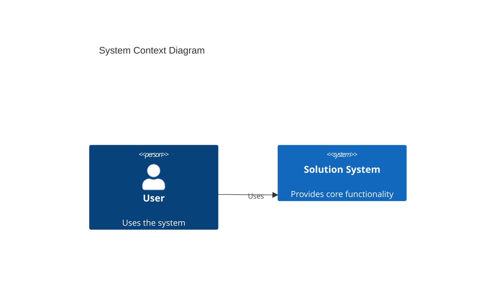

# Solution Architecture Document (SAD) Best Practices

> A comprehensive template and best practices guide for creating Solution Architecture Documents using modern standards and C4 Model.

## 📋 Overview

This repository provides a modern, comprehensive template for Solution Architecture Documents (SAD) that follows industry best practices for 2026. The template incorporates:

- **C4 Model** for architecture visualization
- **Mermaid diagrams** for GitHub-native diagram rendering
- **4+1 Architectural View Model** principles
- **Logical View** and **Deployment View** as required components
- **Entity Relationship Diagrams (ERD)** for data modeling

## 🎯 Purpose

This template helps architects, developers, and technical teams create clear, comprehensive, and maintainable solution architecture documentation that:

- Communicates effectively with stakeholders at all levels
- Provides multiple views of the system (context, containers, components, deployment)
- Documents architectural decisions and rationale
- Serves as a living document throughout the project lifecycle

## 📁 Repository Contents

### Templates (English - Default)
- **`SAD-Template.md`**: Complete SAD template with all sections, diagrams, and examples
- **`ADR-Template.md`**: Lightweight template for Architecture Decision Records (ADR)
- **`README.md`**: This file - repository overview and usage guide

### Examples (English - Default)
- **`Example/Uber-SAD.md`**: Real-world example - Complete SAD for a ride-sharing platform (Uber-like system)
- **`Example/ADR-001-Example.md`**: Example ADR - Microservices architecture decision
- **`Example/ADR-002-Example.md`**: Example ADR - PostgreSQL database choice decision
- **`Example/ADR-011-Example.md`**: Example ADR - PCI DSS compliance for payment processing

### Language-Specific Directories

Templates and examples are available in multiple languages. Each language directory contains:

- **`README.md`**: Language-specific overview and usage guide
- **`SAD-Template.md`**: SAD template (currently in English, translation in progress)
- **`ADR-Template.md`**: ADR template (currently in English, translation in progress)
- **`Example/SAD-Example.md`**: Complete SAD example (currently in English)
- **`Example/ADR-001-Example.md`**: ADR example (currently in English)

**Available Languages:**
- 🇫🇷 **`fr-FR/`** - Français (France)
- 🇹🇼 **`zh-TW/`** - 繁體中文 (台灣)
- 🇨🇳 **`zh-CN/`** - 简体中文 (中国)
- 🇷🇺 **`ru-RU/`** - Русский (Россия)
- 🇩🇪 **`de-DE/`** - Deutsch (Deutschland)
- 🇮🇳 **`hi-IN/`** - हिन्दी (भारत)
- 🇳🇱 **`nl-NL/`** - Nederlands (Nederland)
- 🇰🇷 **`ko-KR/`** - 한국어 (대한민국)
- 🇯🇵 **`ja-JP/`** - 日本語 (日本)
- 🇸🇦 **`ar-SA/`** - العربية (السعودية)
- 🇧🇷 **`pt-BR/`** - Português (Brasil)
- 🇪🇸 **`es-ES/`** - Español (España)
- 🇮🇱 **`he-IL/`** - עברית (ישראל)
- 🇮🇩 **`id-ID/`** - Bahasa Indonesia (Indonesia)

**Note**: Templates are currently in English. Translations to respective languages are planned for future versions. You can use these templates as a base and translate them according to your needs.

## 🚀 Quick Start

1. **Clone or download** this repository
2. **Review** `Example/Uber-SAD.md` to see a complete real-world example
3. **Copy** `SAD-Template.md` to your project
4. **Customize** the template with your specific architecture details
5. **Replace** example diagrams with your actual system architecture
6. **Update** sections with your project-specific information

### 📖 Example Documents

**`Example/Uber-SAD.md`** - Complete real-world example of a ride-sharing platform architecture:
- How to apply the template to a complex system
- Real microservices architecture (Matching, Pricing, Trip, Payment services)
- Real-time location tracking and WebSocket communication
- Complete ERD for ride-sharing domain
- Multi-region deployment strategy
- Event-driven architecture with Kafka

**ADR Examples** - Complete real-world ADR examples in `Example/` directory:
- **`Example/ADR-001-Example.md`**: Microservices architecture decision - demonstrates all optional sections (architecture impact, security, performance, dependencies, deployment)
- **`Example/ADR-002-Example.md`**: PostgreSQL database choice - shows data model impact, performance analysis, and infrastructure requirements
- **`Example/ADR-011-Example.md`**: PCI DSS compliance - demonstrates security impact, compliance requirements, and payment architecture

## 📐 Key Features

### C4 Model Integration
The template uses the C4 Model for architecture visualization at four levels:
- **Level 1**: System Context Diagram
- **Level 2**: Container Diagram (Logical View)
- **Level 3**: Component Diagram
- **Level 4**: Deployment Diagram

### Diagram Types Included
- ✅ System Context (C4Context)
- ✅ Container Diagram (C4Container) - Logical View
- ✅ Component Diagram (C4Component)
- ✅ Deployment Diagram (C4Deployment)
- ✅ Entity Relationship Diagram (ERD)
- ✅ Sequence Diagram (Data Flow)

### Required Views
- ✅ **Logical View**: Shows the functional structure and organization of the system
- ✅ **Deployment View**: Shows how containers are deployed to infrastructure
- ✅ **ERD**: Entity Relationship Diagram for data model documentation

## 📖 Template Sections

The SAD template includes the following sections:

1. **Executive Summary** - Overview and key objectives
2. **Architecture Vision** - Vision, principles, constraints
3. **Business Requirements** - Business problems and functional requirements
4. **Technology Baseline** - Current state and technology stack
5. **System Context** - C4 Level 1 diagram
6. **Logical View** - C4 Level 2 Container diagram
7. **Component View** - C4 Level 3 diagram
8. **Deployment View** - C4 Level 4 diagram
9. **Data Architecture & ERD** - Entity Relationship Diagram
10. **Integration & Data Flow** - Sequence diagrams and integration patterns
11. **Security Architecture** - Security principles and controls
12. **Non-Functional Requirements** - Performance, scalability, availability
13. **Architectural Decisions** - ADR log and key decisions
14. **Risks & Mitigation** - Risk assessment and mitigation strategies

## 🛠️ Using Mermaid Diagrams

All diagrams in this template use **Mermaid syntax**, which renders natively on GitHub. The diagrams will automatically display when you:

- View the file on GitHub
- Use GitHub-compatible markdown viewers
- Use editors with Mermaid support (VS Code, Cursor, etc.)

### Example Mermaid Diagram

## 📝 Architecture Decision Records (ADR)

### What are ADRs?

Architecture Decision Records (ADRs) document important architectural decisions, their context, alternatives considered, and consequences. They help teams understand why certain choices were made and provide a historical record of architectural evolution.

### Using the ADR Template

1. **Copy** `ADR-Template.md` for each new decision
2. **Rename** to `ADR-XXX-[Short-Title].md` (e.g., `ADR-001-Microservices.md`)
3. **Fill in** all sections with your decision details
4. **Review** `ADR-001-Example.md` to see a complete example
5. **Maintain** ADRs as decisions evolve or are superseded

### ADR Template Features

- ✅ **Lightweight**: Simple, focused format - no unnecessary complexity
- ✅ **Just Enough**: Covers all essential aspects without being verbose
- ✅ **Easy to Write**: Clear structure with helpful prompts
- ✅ **Easy to Maintain**: Status tracking, references, and notes for updates
- ✅ **Comprehensive Optional Sections**: When needed, document architecture impact, security, performance, dependencies, and deployment

### ADR Optional Sections

The template includes **optional sections** for decisions that significantly impact the architecture:

- **Architecture Impact**: Context/Container diagrams, logical flow changes
- **Data Model Impact**: ERD changes, schema migrations
- **Security Impact**: Security analysis, threats, mitigations
- **Performance Impact**: Latency, throughput, resource usage analysis
- **Dependencies & Libraries**: New dependencies, version management, risks
- **Deployment Impact**: Infrastructure changes, deployment process, requirements

**When to use optional sections:**
- Use when the decision changes system architecture (diagrams, flows)
- Use when the decision affects security posture
- Use when the decision impacts performance significantly
- Use when introducing new dependencies or libraries
- Use when deployment or infrastructure changes are required

**When to skip optional sections:**
- Simple technology choices (e.g., "Use library X instead of Y")
- Decisions that don't affect architecture diagrams
- Minor configuration changes
- Decisions with no security or performance implications

### ADR Best Practices

- **Number sequentially**: ADR-001, ADR-002, etc.
- **Update status**: Proposed → Accepted → Deprecated/Superseded
- **Link related ADRs**: Reference decisions that influence or are influenced by this one
- **Keep current**: Update ADRs when decisions change or are superseded
- **Review regularly**: Periodically review ADRs to ensure they're still accurate
- **Use optional sections wisely**: Include them when the decision has significant impact, skip them for simple decisions

## 📚 Best Practices

### When Creating Your SAD

1. **Start with Context**: Begin with the System Context diagram to establish scope
2. **Progressive Detail**: Move from high-level (Context) to detailed (Component) views
3. **Keep It Current**: Update the document as the architecture evolves
4. **Stakeholder Focus**: Tailor sections to your audience's needs
5. **Document Decisions**: Record architectural decisions with rationale using ADRs
6. **Visual First**: Use diagrams to communicate, text to explain

### Diagram Guidelines

- **Keep diagrams simple**: Focus on key relationships and components
- **Use consistent naming**: Follow naming conventions throughout
- **Update together**: When architecture changes, update all related diagrams
- **Add descriptions**: Always provide text descriptions alongside diagrams

## 🔄 Version History

- **v1.6** (2026-01-26): Added multi-language support
  - Created language-specific directories for 14 languages (fr-FR, zh-TW, zh-CN, ru-RU, de-DE, hi-IN, nl-NL, ko-KR, ja-JP, ar-SA, pt-BR, es-ES, he-IL, id-ID)
  - Each language directory contains SAD-Template.md, ADR-Template.md, and examples
  - Added README.md for each language directory
  - Templates are currently in English, translations planned for future versions
  
- **v1.5** (2026-01-26): Organized examples into directory
  - Created `Example/` directory for all example files
  - Moved `Uber-SAD.md` and all ADR examples to `Example/` directory
  - Updated README with new directory structure
  - Added `Example/README.md` to explain examples
  
- **v1.4** (2026-01-26): Added additional ADR examples
  - Added `ADR-002-Example.md` - PostgreSQL database choice decision
  - Added `ADR-011-Example.md` - PCI DSS compliance decision
  - Both examples demonstrate different use cases of optional sections
  
- **v1.3** (2026-01-26): Enhanced ADR template with optional sections
  - Added optional sections: Architecture Impact (Context/Container diagrams, flows), Data Model Impact (ERD), Security Impact, Performance Impact, Dependencies & Libraries, Deployment Impact
  - Updated `ADR-001-Example.md` to demonstrate usage of optional sections
  - Enhanced README with guidance on when to use optional sections
  
- **v1.2** (2026-01-26): Added ADR templates
  - Added `ADR-Template.md` - Lightweight ADR template following 2026 best practices
  - Added `ADR-001-Example.md` - Complete ADR example for microservices decision
  - Updated README with ADR section and best practices
  
- **v1.1** (2026-01-26): Added real-world example
  - Added `Uber-SAD.md` - Complete SAD example for ride-sharing platform
  - Demonstrates microservices architecture, real-time systems, and event-driven patterns
  
- **v1.0** (2026-01-26): Initial template release
  - Complete SAD structure
  - C4 Model diagrams (all 4 levels)
  - ERD with Mermaid syntax
  - Logical and Deployment views
  - Comprehensive sections covering all aspects

## 🤝 Contributing

Contributions are welcome! If you have suggestions for improving the template:

1. Fork the repository
2. Make your changes
3. Submit a pull request with a clear description

## 📄 License

This template is provided as-is for use in your projects. Feel free to adapt it to your needs.

## 🔗 References

- [C4 Model](https://c4model.com/) - Architecture visualization model
- [Mermaid Documentation](https://mermaid.js.org/) - Diagram syntax reference
- [4+1 Architectural View Model](https://en.wikipedia.org/wiki/4%2B1_architectural_view_model) - Architectural views framework
- [ADR GitHub](https://adr.github.io/) - Architecture Decision Records documentation
- [MADR](https://adr.github.io/madr/) - Markdown Architectural Decision Records

## 💡 Tips

- **Customize for your needs**: Remove sections that don't apply to your project
- **Add examples**: Include real examples from your system
- **Keep it visual**: Diagrams are often more effective than long text descriptions
- **Review regularly**: Schedule periodic reviews to keep documentation current

---

**Last Updated**: January 2026  
**Template Version**: 1.0
