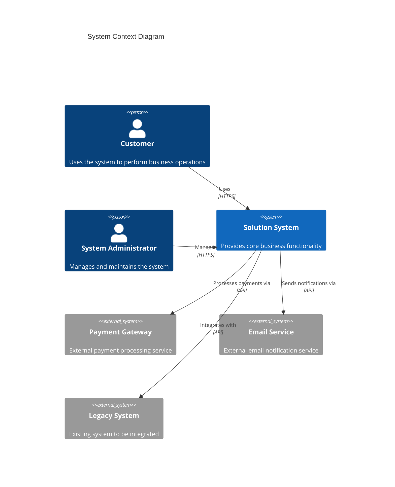
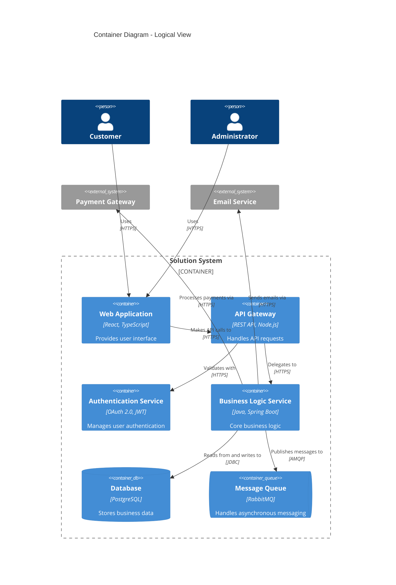
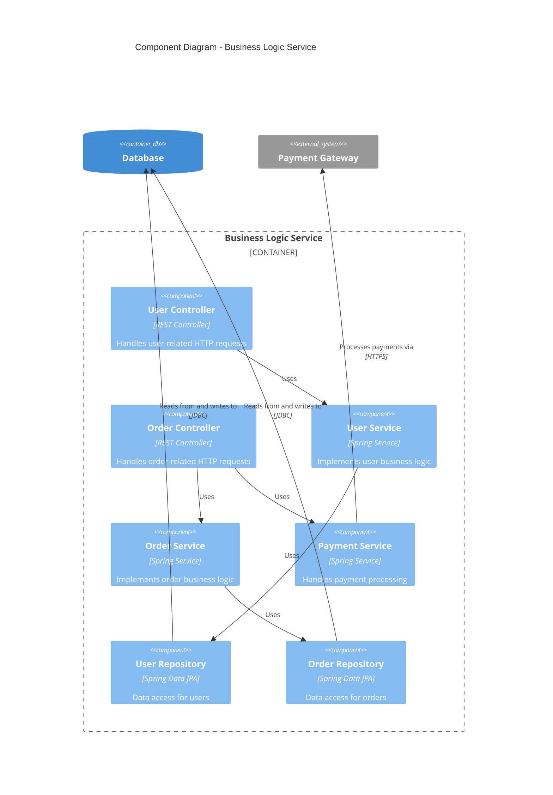
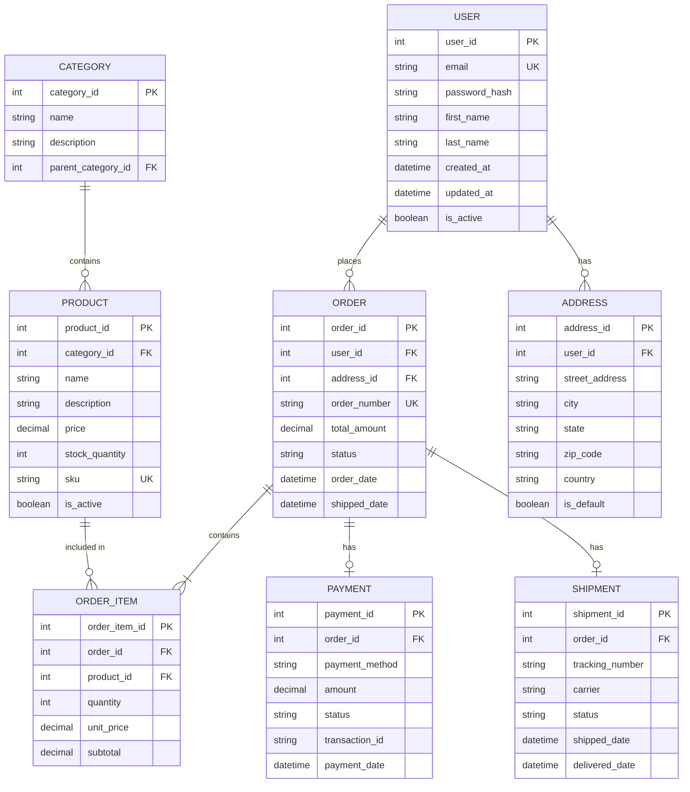
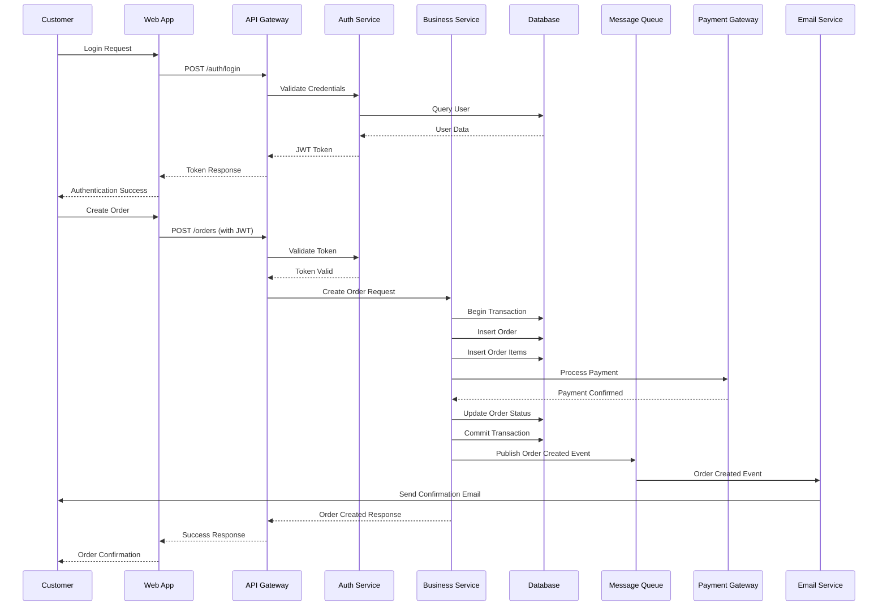
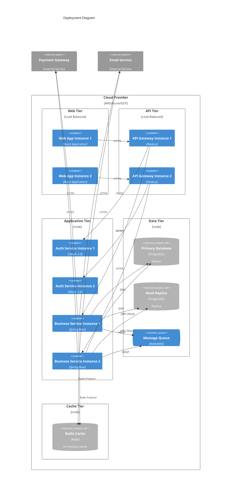

# Solution Architecture Document (SAD) Template

> **Version:** 1.0  
> **Last Updated:** 2026  
> **Purpose:** Template for documenting solution architecture using modern best practices

---

## Table of Contents

1. [Executive Summary](#1-executive-summary)
2. [Architecture Vision](#2-architecture-vision)
3. [Business Requirements](#3-business-requirements)
4. [Technology Baseline](#4-technology-baseline)
5. [System Context (C4 Level 1)](#5-system-context-c4-level-1)
6. [Logical View (C4 Level 2 - Container)](#6-logical-view-c4-level-2---container)
7. [Component View (C4 Level 3)](#7-component-view-c4-level-3)
8. [Data Architecture & ERD](#8-data-architecture--erd)
9. [Integration & Data Flow](#9-integration--data-flow)
10. [Security Architecture](#10-security-architecture)
11. [Deployment View](#11-deployment-view)
12. [Non-Functional Requirements](#12-non-functional-requirements)
13. [Architectural Decisions](#13-architectural-decisions)
14. [Risks & Mitigation](#14-risks--mitigation)

---

## 1. Executive Summary

### 1.1 Purpose
Brief overview of the solution, its objectives, and key stakeholders.

### 1.2 Scope
Define what is included and excluded from this architecture.

### 1.3 Key Objectives
- Objective 1
- Objective 2
- Objective 3

### 1.4 Success Criteria
- Criteria 1
- Criteria 2
- Criteria 3

---

## 2. Architecture Vision

### 2.1 Vision Statement
High-level vision describing the desired future state of the solution.

### 2.2 Architecture Principles
- **Principle 1**: Description
- **Principle 2**: Description
- **Principle 3**: Description

### 2.3 Constraints & Assumptions
- **Constraints**: Technical, business, or regulatory limitations
- **Assumptions**: Key assumptions about the environment, users, or technology

---

## 3. Business Requirements

### 3.1 Business Problem
Description of the business problem this solution addresses.

### 3.2 Business Objectives
- Objective 1
- Objective 2
- Objective 3

### 3.3 Stakeholders
| Stakeholder | Role | Concerns |
|------------|------|----------|
| Stakeholder 1 | Role | Concerns |
| Stakeholder 2 | Role | Concerns |

### 3.4 Functional Requirements
- FR-1: Requirement description
- FR-2: Requirement description
- FR-3: Requirement description

---

## 4. Technology Baseline

### 4.1 Current State
Description of the existing technology landscape.

### 4.2 Technology Stack
- **Frontend**: Technologies
- **Backend**: Technologies
- **Database**: Technologies
- **Infrastructure**: Technologies
- **Integration**: Technologies

### 4.3 Dependencies
- External systems
- Third-party services
- Legacy systems

---

## 5. System Context (C4 Level 1)

The System Context diagram provides the highest level view of the system, showing how it interacts with users and other systems.

### 5.1 System Description
Description of the system and its purpose.

### 5.2 External Systems
- **Payment Gateway**: Purpose and integration method
- **Email Service**: Purpose and integration method
- **Legacy System**: Purpose and integration method

---

## 6. Logical View (C4 Level 2 - Container)

The Container diagram shows the high-level technical building blocks and how they interact.

### 6.1 Container Descriptions

#### 6.1.1 Web Application
- **Technology**: React, TypeScript
- **Purpose**: User interface layer
- **Responsibilities**: 
  - User interaction
  - Data presentation
  - Client-side validation

#### 6.1.2 API Gateway
- **Technology**: REST API, Node.js
- **Purpose**: API orchestration and routing
- **Responsibilities**:
  - Request routing
  - Rate limiting
  - Request/response transformation

#### 6.1.3 Authentication Service
- **Technology**: OAuth 2.0, JWT
- **Purpose**: User authentication and authorization
- **Responsibilities**:
  - User authentication
  - Token management
  - Session management

#### 6.1.4 Business Logic Service
- **Technology**: Java, Spring Boot
- **Purpose**: Core business logic execution
- **Responsibilities**:
  - Business rule enforcement
  - Data processing
  - Integration orchestration

#### 6.1.5 Database
- **Technology**: PostgreSQL
- **Purpose**: Data persistence
- **Responsibilities**:
  - Data storage
  - Data retrieval
  - Transaction management

#### 6.1.6 Message Queue
- **Technology**: RabbitMQ
- **Purpose**: Asynchronous messaging
- **Responsibilities**:
  - Message queuing
  - Event distribution
  - Decoupling services

---

## 7. Component View (C4 Level 3)

The Component diagram shows how a container is made up of components and their relationships.

### 7.1 Component Descriptions

#### 7.1.1 Controllers
- **User Controller**: Handles user management endpoints
- **Order Controller**: Handles order management endpoints

#### 7.1.2 Services
- **User Service**: Implements user-related business logic
- **Order Service**: Implements order-related business logic
- **Payment Service**: Handles payment processing logic

#### 7.1.3 Repositories
- **User Repository**: Data access layer for user entities
- **Order Repository**: Data access layer for order entities

---

## 8. Data Architecture & ERD

### 8.1 Data Model Overview
Description of the data model and key entities.

### 8.2 Entity Relationship Diagram (ERD)

### 8.3 Entity Descriptions

#### 8.3.1 USER
- **Purpose**: Stores user account information
- **Key Attributes**: 
  - `user_id`: Primary key
  - `email`: Unique identifier for login
  - `password_hash`: Encrypted password
- **Relationships**: One-to-many with ORDER, one-to-many with ADDRESS

#### 8.3.2 ORDER
- **Purpose**: Represents customer orders
- **Key Attributes**:
  - `order_id`: Primary key
  - `order_number`: Unique order identifier
  - `status`: Order status (pending, processing, shipped, delivered, cancelled)
- **Relationships**: Many-to-one with USER, one-to-many with ORDER_ITEM, one-to-one with PAYMENT, one-to-one with SHIPMENT

#### 8.3.3 PRODUCT
- **Purpose**: Product catalog information
- **Key Attributes**:
  - `product_id`: Primary key
  - `sku`: Stock Keeping Unit (unique)
  - `price`: Product price
  - `stock_quantity`: Available inventory
- **Relationships**: Many-to-one with CATEGORY, one-to-many with ORDER_ITEM

#### 8.3.4 CATEGORY
- **Purpose**: Product categorization
- **Key Attributes**:
  - `category_id`: Primary key
  - `parent_category_id`: Self-referencing for hierarchical categories
- **Relationships**: One-to-many with PRODUCT, self-referencing for parent-child relationships

### 8.4 Data Storage Strategy
- **Primary Database**: PostgreSQL for transactional data
- **Caching**: Redis for frequently accessed data
- **Backup**: Daily automated backups with 30-day retention
- **Archiving**: Long-term data archiving strategy

### 8.5 Data Flow
- **Write Operations**: All writes go to primary database
- **Read Operations**: Read replicas for read-heavy operations
- **Cache Strategy**: Cache frequently accessed data with TTL

---

## 9. Integration & Data Flow

### 9.1 Integration Architecture

### 9.2 Integration Patterns
- **REST API**: Synchronous communication between services
- **Message Queue**: Asynchronous event-driven communication
- **API Gateway**: Centralized API management and routing

### 9.3 External Integrations
- **Payment Gateway**: REST API integration for payment processing
- **Email Service**: REST API integration for email notifications
- **Legacy System**: API integration for data synchronization

---

## 10. Security Architecture

### 10.1 Security Principles
- **Defense in Depth**: Multiple layers of security controls
- **Least Privilege**: Minimal access rights required
- **Zero Trust**: Verify every request, trust no one by default

### 10.2 Authentication & Authorization
- **Authentication**: OAuth 2.0 with JWT tokens
- **Authorization**: Role-Based Access Control (RBAC)
- **Token Management**: Short-lived access tokens with refresh tokens

### 10.3 Data Security
- **Encryption at Rest**: Database encryption using AES-256
- **Encryption in Transit**: TLS 1.3 for all communications
- **PII Protection**: Data masking and anonymization for sensitive data

### 10.4 Network Security
- **VPC**: Network isolation
- **Security Groups**: Firewall rules for network access
- **WAF**: Web Application Firewall for API protection
- **DDoS Protection**: Distributed Denial of Service mitigation

### 10.5 Compliance
- **GDPR**: Data protection and privacy compliance
- **SOC 2**: Security and availability controls
- **PCI DSS**: Payment card data security (if applicable)

---

## 11. Deployment View

The Deployment diagram shows how containers are deployed to infrastructure.

### 11.1 Infrastructure Overview

#### 11.1.1 Web Tier
- **Instances**: 2+ load-balanced web application instances
- **Technology**: React application served via CDN/Web Server
- **Scaling**: Horizontal scaling based on load

#### 11.1.2 API Tier
- **Instances**: 2+ load-balanced API gateway instances
- **Technology**: Node.js
- **Scaling**: Horizontal scaling based on request volume

#### 11.1.3 Application Tier
- **Auth Service**: 2+ instances for high availability
- **Business Service**: 2+ instances for high availability
- **Technology**: Spring Boot microservices
- **Scaling**: Horizontal scaling based on CPU/memory metrics

#### 11.1.4 Data Tier
- **Primary Database**: PostgreSQL master instance
- **Read Replica**: PostgreSQL replica for read operations
- **Message Queue**: RabbitMQ cluster
- **Backup Strategy**: Daily automated backups with point-in-time recovery

#### 11.1.5 Cache Tier
- **Technology**: Redis
- **Purpose**: In-memory caching for improved performance
- **Scaling**: Redis cluster for high availability

### 11.2 Deployment Strategy
- **Blue-Green Deployment**: Zero-downtime deployments
- **Rolling Updates**: Gradual rollout of new versions
- **Health Checks**: Automated health monitoring and auto-recovery

### 11.3 Network Architecture
- **VPC**: Virtual Private Cloud for network isolation
- **Subnets**: Public and private subnets for security
- **Load Balancers**: Application Load Balancers for traffic distribution
- **Security Groups**: Network-level access control

---

## 12. Non-Functional Requirements

### 12.1 Performance
- **Response Time**: API responses < 200ms (p95)
- **Throughput**: Support 1000 requests/second
- **Database Query**: Query execution < 100ms (p95)

### 12.2 Scalability
- **Horizontal Scaling**: Auto-scaling based on CPU/memory metrics
- **Database Scaling**: Read replicas for read-heavy workloads
- **Caching**: Redis caching for frequently accessed data

### 12.3 Availability
- **Uptime Target**: 99.9% availability (8.76 hours downtime/year)
- **High Availability**: Multi-AZ deployment
- **Disaster Recovery**: RTO < 4 hours, RPO < 1 hour

### 12.4 Reliability
- **Error Handling**: Comprehensive error handling and retry logic
- **Circuit Breaker**: Circuit breaker pattern for external service calls
- **Health Checks**: Automated health monitoring and auto-recovery

### 12.5 Maintainability
- **Code Quality**: Code reviews, automated testing
- **Documentation**: Comprehensive technical documentation
- **Monitoring**: Application performance monitoring and logging

### 12.6 Usability
- **User Interface**: Intuitive and responsive design
- **Accessibility**: WCAG 2.1 AA compliance
- **Mobile Support**: Responsive design for mobile devices

---

## 13. Architectural Decisions

### 13.1 Decision Log

| ID | Decision | Status | Date | Rationale |
|----|----------|--------|------|-----------|
| ADR-001 | Use microservices architecture | Accepted | 2026-01-01 | Enables independent scaling and deployment |
| ADR-002 | PostgreSQL as primary database | Accepted | 2026-01-01 | ACID compliance, strong consistency requirements |
| ADR-003 | REST API for synchronous communication | Accepted | 2026-01-01 | Standard protocol, easy integration |
| ADR-004 | Message queue for asynchronous communication | Accepted | 2026-01-01 | Decoupling, improved resilience |
| ADR-005 | OAuth 2.0 for authentication | Accepted | 2026-01-01 | Industry standard, secure, scalable |

### 13.2 Key Decisions

#### ADR-001: Microservices Architecture
- **Context**: Need for independent scaling and deployment
- **Decision**: Adopt microservices architecture
- **Consequences**: 
  - ✅ Independent scaling
  - ✅ Technology diversity
  - ❌ Increased complexity
  - ❌ Network latency

#### ADR-002: PostgreSQL Database
- **Context**: Need for ACID compliance and strong consistency
- **Decision**: Use PostgreSQL as primary database
- **Consequences**:
  - ✅ ACID compliance
  - ✅ Strong consistency
  - ✅ Rich feature set
  - ❌ Vertical scaling limitations

---

## 14. Risks & Mitigation

### 14.1 Technical Risks

| Risk | Impact | Probability | Mitigation |
|------|--------|-------------|------------|
| Database performance degradation | High | Medium | Read replicas, query optimization, caching |
| External service downtime | High | Low | Circuit breaker, fallback mechanisms, retry logic |
| Security breach | Critical | Low | Multi-layer security, regular audits, monitoring |

### 14.2 Operational Risks

| Risk | Impact | Probability | Mitigation |
|------|--------|-------------|------------|
| Deployment failures | Medium | Medium | Blue-green deployment, automated testing, rollback procedures |
| Data loss | Critical | Low | Automated backups, point-in-time recovery, replication |

### 14.3 Business Risks

| Risk | Impact | Probability | Mitigation |
|------|--------|-------------|------------|
| Scope creep | Medium | High | Change management process, stakeholder alignment |
| Resource constraints | Medium | Medium | Resource planning, capacity management |

---

## Appendix

### A. Glossary
- **API**: Application Programming Interface
- **JWT**: JSON Web Token
- **RBAC**: Role-Based Access Control
- **VPC**: Virtual Private Cloud
- **WAF**: Web Application Firewall

### B. References
- [C4 Model](https://c4model.com/)
- [Mermaid Documentation](https://mermaid.js.org/)
- [4+1 Architectural View Model](https://en.wikipedia.org/wiki/4%2B1_architectural_view_model)

### C. Document History
| Version | Date | Author | Changes |
|---------|------|--------|---------|
| 1.0 | 2026-01-26 | Architecture Team | Initial template |

---

**Document Status**: Template  
**Next Review Date**: As needed  
**Approval**: Pending
