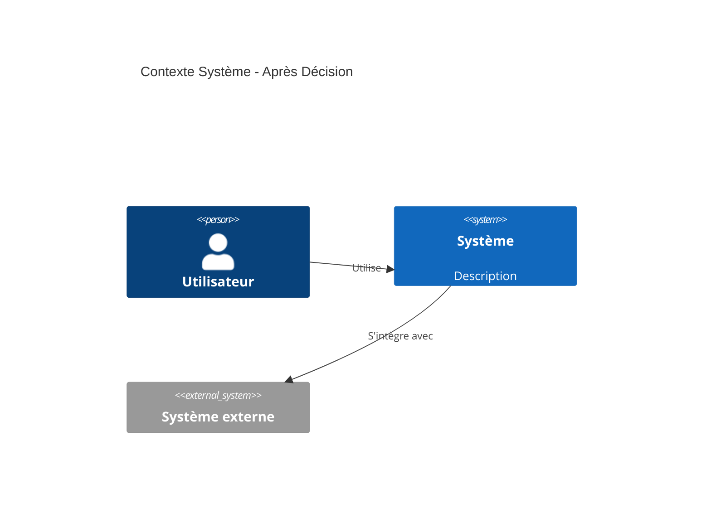
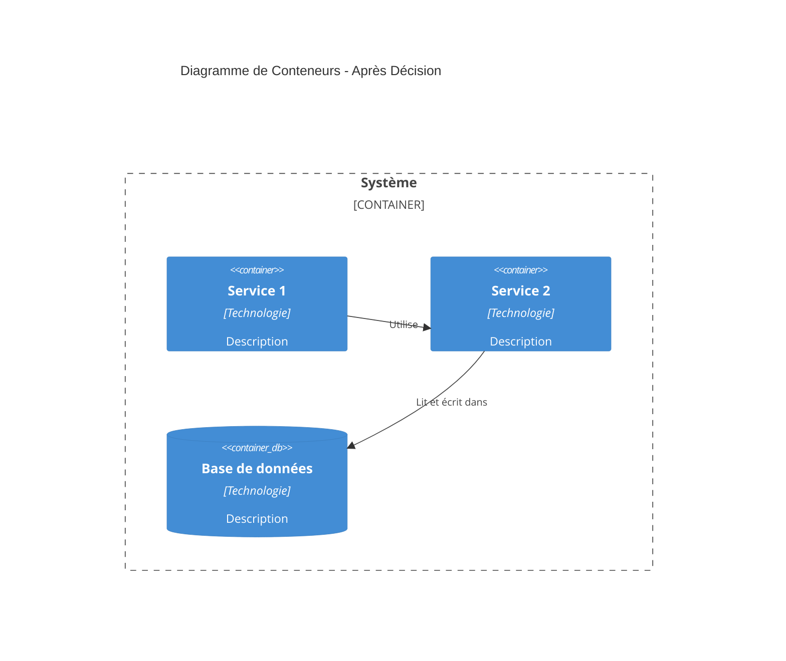
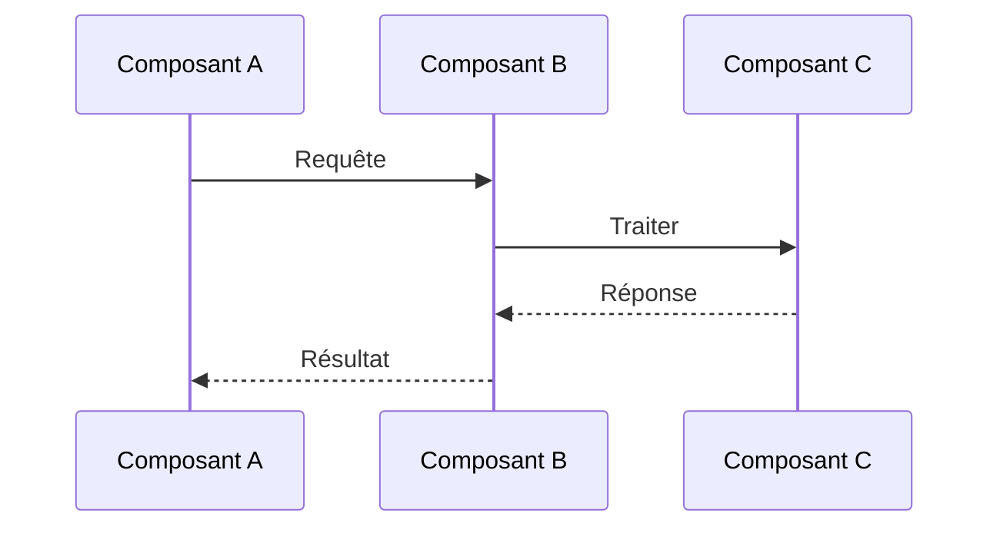
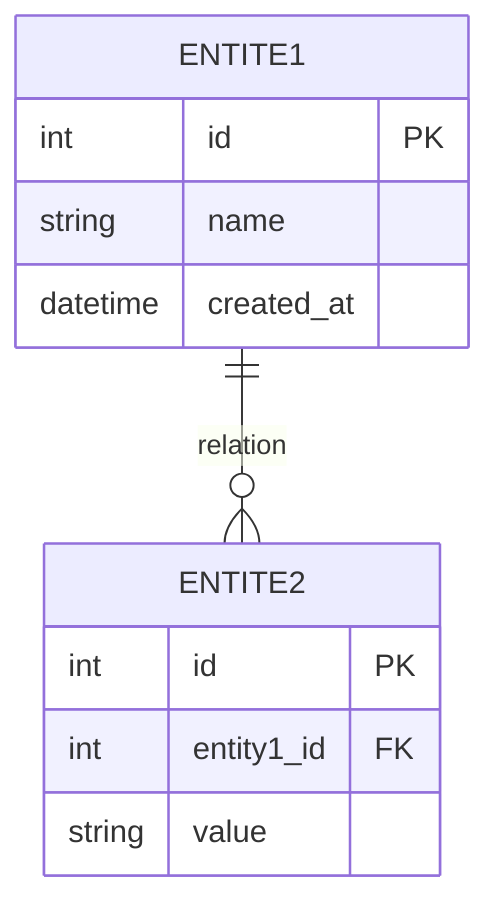

# Modèle ADR

> **Objectif**: Modèle léger pour les Enregistrements de Décisions Architecturales (ADR)  
> **Format**: Markdown  
> **Version**: 1.0 (2026)

---

## ADR-XXX: [Titre court de la décision]

**Statut**: [Proposé | Accepté | Déprécié | Remplacé]  
**Date**: AAAA-MM-JJ  
**Décideurs**: [Noms ou rôles des décideurs]  
**Tags**: [technologie, pattern, service, etc.]

---

## Contexte

**Quel est le problème ou la question à laquelle nous sommes confrontés ?**

Décrivez la situation, les contraintes et les exigences qui ont conduit à cette décision. Incluez :
- Problème métier ou technique
- État actuel et limitations
- Exigences qui doivent être traitées
- Toute contrainte (temps, budget, technologie, compétences de l'équipe)

**Exemple :**
> Nous devons gérer 1 million d'utilisateurs simultanés avec des temps de réponse inférieurs à 5 secondes. Notre architecture monolithique actuelle ne peut pas être mise à l'échelle horizontalement et le déploiement d'une fonctionnalité nécessite le redéploiement de tout le système.

---

## Décision

**Qu'avons-nous décidé ?**

Énoncez la décision clairement et de manière concise. Soyez précis sur la technologie, le pattern ou l'approche choisie.

**Exemple :**
> Nous adopterons une architecture microservices avec des limites de service basées sur les capacités métier. Chaque service sera indépendamment déployable et évolutif.

---

## Options considérées

**Quelles alternatives avons-nous considérées ?**

Listez les options qui ont été évaluées, avec de brefs avantages et inconvénients pour chacune.

### Option 1 : [Nom de l'option]

**Avantages :**
- Avantage 1
- Avantage 2

**Inconvénients :**
- Inconvénient 1
- Inconvénient 2

### Option 2 : [Nom de l'option]

**Avantages :**
- Avantage 1
- Avantage 2

**Inconvénients :**
- Inconvénient 1
- Inconvénient 2

### Option 3 : [Nom de l'option] (si applicable)

**Avantages :**
- Avantage 1

**Inconvénients :**
- Inconvénient 1

---

## Résultat de la décision

**Pourquoi avons-nous choisi cette option ?**

Expliquez la justification du choix de cette option plutôt que les alternatives. Référencez des exigences, contraintes ou critères d'évaluation spécifiques.

**Exemple :**
> Nous avons choisi les microservices car cela permet une mise à l'échelle indépendante des services en fonction de la charge, permet la diversité technologique (Go pour les services critiques en performance, Node.js pour les services en temps réel), et supporte des cycles de déploiement plus rapides. Bien que cela augmente la complexité opérationnelle, les avantages l'emportent sur les coûts pour notre échelle et nos exigences.

---

## Conséquences

**Quels sont les impacts positifs et négatifs de cette décision ?**

### Positif

- Avantage 1
- Avantage 2
- Avantage 3

### Négatif

- Compromis 1
- Compromis 2
- Compromis 3

### Neutre / Notes

- Considération supplémentaire 1
- Implications futures 2

---

## Impact sur l'architecture (Optionnel)

**Utilisez cette section lorsque la décision modifie significativement l'architecture du système.**

### Modifications du diagramme de contexte

**Cette décision modifie-t-elle le contexte système ?** (Optionnel)

Si cette décision ajoute, supprime ou modifie des systèmes externes ou des acteurs, décrivez les modifications ici.

**Modifications :**
- Ajouté/supprimé/modifié : [Description]

### Modifications du diagramme de conteneurs

**Cette décision modifie-t-elle la vue conteneur/logique ?** (Optionnel)

Si cette décision ajoute, supprime ou modifie des conteneurs (services, bases de données, etc.), montrez les modifications ici.

**Modifications :**
- Conteneur ajouté : [Nom du service/base de données] - [Raison]
- Conteneur supprimé : [Nom du service/base de données] - [Raison]
- Conteneur modifié : [Nom du service/base de données] - [Modifications]

### Modifications du flux logique

**Cette décision modifie-t-elle le flux de données ou le flux de processus ?** (Optionnel)

Si cette décision modifie la façon dont les données ou les requêtes circulent dans le système, documentez-le ici.

**Modifications :**
- Flux modifié : [Description de la modification]
- Nouveau flux : [Description]

---

## Impact sur le modèle de données (Optionnel)

**Utilisez cette section lorsque la décision affecte le schéma de base de données ou le modèle de données.**

### Modifications ERD

**Cette décision modifie-t-elle le diagramme de relation d'entité ?** (Optionnel)

Si cette décision ajoute, supprime ou modifie des tables, colonnes ou relations de base de données, documentez-le ici.

**Modifications :**
- **Nouvelles tables** : [Nom de la table] - [Objectif]
- **Tables modifiées** : 
  - [Nom de la table] : Colonnes ajoutées [liste], Colonnes supprimées [liste]
- **Nouvelles relations** : [Description]
- **Relations modifiées** : [Description]

### Notes sur la migration du schéma

- Emplacement du script de migration : [Chemin]
- Migration de données requise : Oui/Non
- Stratégie de retour en arrière : [Description]

---

## Impact sur la sécurité (Optionnel)

**Utilisez cette section lorsque la décision a des implications en matière de sécurité.**

### Analyse de sécurité

**Quelles préoccupations de sécurité ont été analysées ?**

- **Menace** : [Description de la menace de sécurité]
  - **Niveau de risque** : [Élevé | Moyen | Faible]
  - **Atténuation** : [Comment c'est traité]

- **Menace** : [Description]
  - **Niveau de risque** : [Élevé | Moyen | Faible]
  - **Atténuation** : [Comment c'est traité]

### Mesures de sécurité

**Quelles mesures de sécurité sont implémentées ou requises ?**

- Modifications d'authentification/autorisation : [Description]
- Chiffrement des données : [Description]
- Sécurité réseau : [Description]
- Exigences de conformité : [PCI DSS, GDPR, etc.]
- Tests de sécurité : [Tests requis]

### Compromis de sécurité

- **Positif** : [Améliorations de sécurité]
- **Négatif** : [Préoccupations ou limitations de sécurité]

---

## Impact sur les performances (Optionnel)

**Utilisez cette section lorsque la décision affecte les performances du système.**

### Analyse des performances

**Comment cette décision affecte-t-elle les performances ?**

- **Latence** : [Impact sur le temps de réponse]
  - Avant : [Référence]
  - Après : [Attendu]
  - Changement : [Amélioration/Dégradation]

- **Débit** : [Impact sur les requêtes par seconde]
  - Avant : [Référence]
  - Après : [Attendu]
  - Changement : [Amélioration/Dégradation]

- **Utilisation des ressources** : [CPU, Mémoire, Réseau]
  - Avant : [Référence]
  - Après : [Attendu]
  - Changement : [Augmentation/Diminution]

### Optimisations des performances

**Quelles optimisations sont implémentées ou prévues ?**

- Stratégie de mise en cache : [Description]
- Optimisation de la base de données : [Description]
- Optimisation réseau : [Description]
- Équilibrage de charge : [Description]

### Surveillance des performances

**Quelles métriques seront surveillées ?**

- Métriques clés : [Liste]
- Seuils d'alerte : [Description]
- Tests de performance : [Tests requis]

---

## Dépendances et bibliothèques (Optionnel)

**Utilisez cette section lorsque la décision introduit de nouvelles dépendances ou bibliothèques.**

### Nouvelles dépendances

**Quelles nouvelles dépendances ou bibliothèques sont introduites ?**

| Dépendance | Version | Objectif | Licence |
|------------|---------|----------|---------|
| nom-bibliotheque | 1.0.0 | Objectif | MIT/Apache/etc. |
| nom-framework | 2.0.0 | Objectif | Licence |

### Gestion des dépendances

- Gestionnaire de paquets : [npm, Maven, Go modules, etc.]
- Stratégie d'épinglage de version : [Exacte, Plage, Dernière]
- Politique de mise à jour : [Comment les dépendances seront mises à jour]

### Risques des dépendances

- **Sécurité** : [Vulnérabilités connues, fréquence de mise à jour]
- **Maintenance** : [Maintenance active, support communautaire]
- **Licence** : [Compatibilité des licences, préoccupations légales]
- **Taille** : [Impact sur la taille du bundle, temps de démarrage]

---

## Impact sur le déploiement (Optionnel)

**Utilisez cette section lorsque la décision affecte le déploiement ou l'infrastructure.**

### Modifications de l'infrastructure

**Quelles modifications d'infrastructure sont requises ?**

- **Nouveaux services** : [Liste des nouveaux services/composants]
- **Services modifiés** : [Liste des services modifiés]
- **Services supprimés** : [Liste des services supprimés]
- **Modifications de configuration** : [Variables d'environnement, fichiers de configuration]

### Modifications du processus de déploiement

**Comment le déploiement change-t-il ?**

- **Avant** : [Processus de déploiement actuel]
- **Après** : [Nouveau processus de déploiement]
- **Étapes de migration** : [Étapes pour migrer]

### Considérations de déploiement

- **Stratégie de retour en arrière** : [Comment revenir en arrière si nécessaire]
- **Zéro temps d'arrêt** : [Le déploiement sans temps d'arrêt est-il possible ?]
- **Migrations de base de données** : [Migrations requises]
- **Drapeaux de fonctionnalité** : [Drapeaux de fonctionnalité requis]
- **Surveillance** : [Nouveaux besoins de surveillance]

### Exigences d'infrastructure

- **Calcul** : [CPU, Exigences mémoire]
- **Stockage** : [Exigences de stockage]
- **Réseau** : [Exigences réseau, bande passante]
- **Services tiers** : [Services externes nécessaires]

---

## Notes d'implémentation

**Comment allons-nous implémenter cette décision ?** (Optionnel)

- Étape 1 ou ligne directrice
- Étape 2 ou ligne directrice
- Référence à la documentation connexe

---

## Références

- [Lien vers ADR connexe](#)
- [Ressource ou documentation externe](#)
- [Décision ou pattern connexe](#)

---

## Notes

**Contexte supplémentaire, décisions de suivi ou modifications** (Optionnel)

- Note 1
- Note 2

---

**Dernière mise à jour** : AAAA-MM-JJ  
**ADRs connexes** : [ADR-XXX](#), [ADR-YYY](#)
