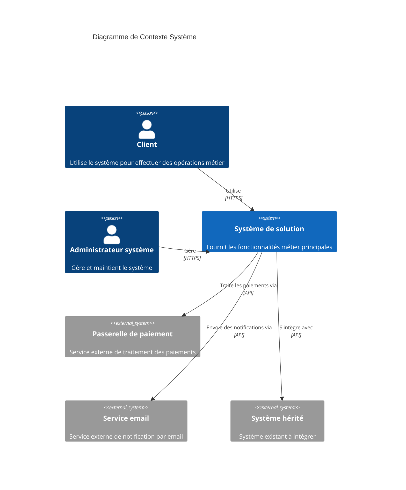
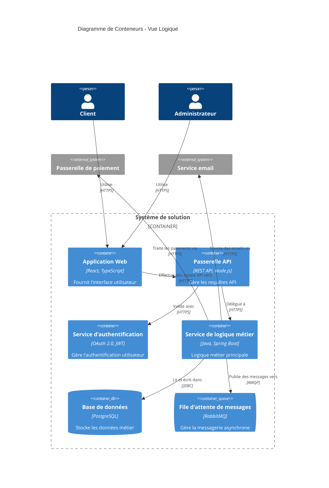
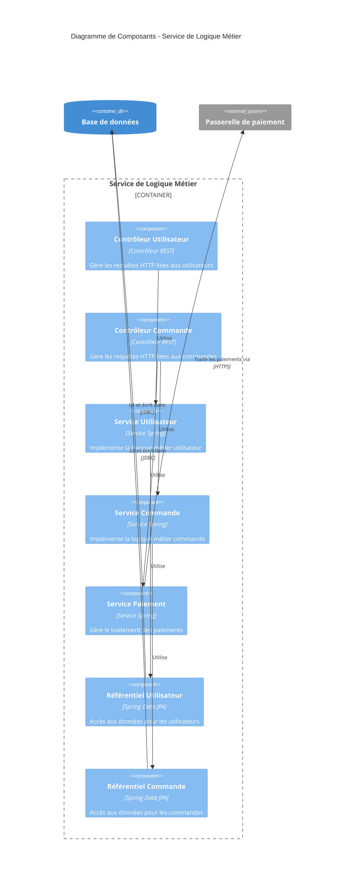
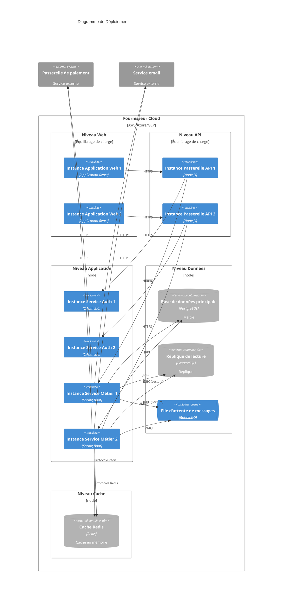
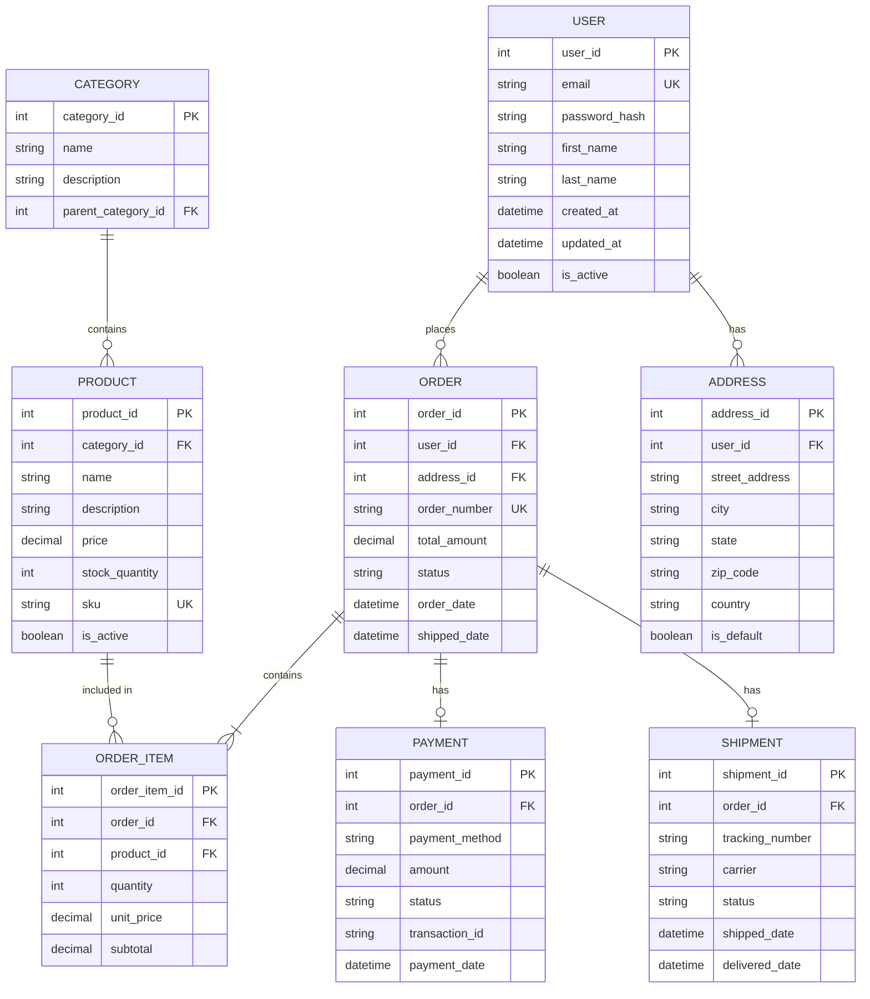
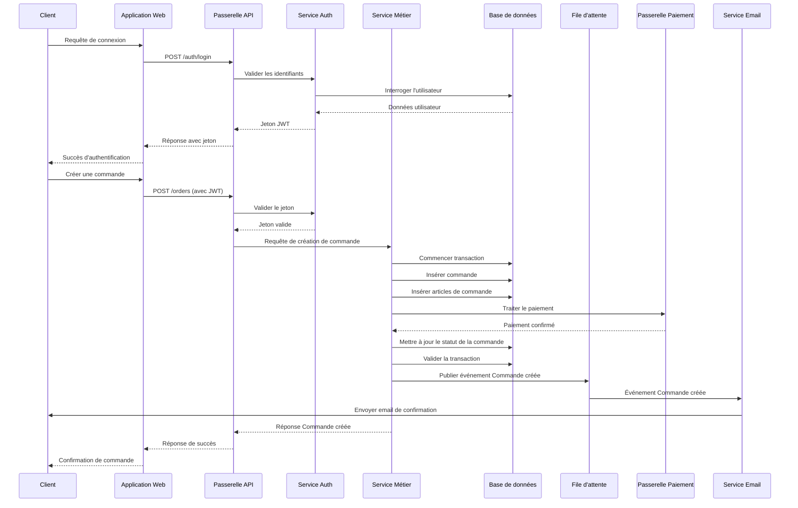

# Modèle de Document d'Architecture de Solution (SAD)

> **Version:** 1.0  
> **Dernière mise à jour:** 2026  
> **Objectif:** Modèle pour documenter l'architecture de solution en utilisant les meilleures pratiques modernes

---

## Table des matières

1. [Résumé exécutif](#1-résumé-exécutif)
2. [Vision de l'architecture](#2-vision-de-larchitecture)
3. [Exigences métier](#3-exigences-métier)
4. [Référentiel technologique](#4-référentiel-technologique)
5. [Contexte système (C4 Niveau 1)](#5-contexte-système-c4-niveau-1)
6. [Vue logique (C4 Niveau 2 - Conteneur)](#6-vue-logique-c4-niveau-2---conteneur)
7. [Vue des composants (C4 Niveau 3)](#7-vue-des-composants-c4-niveau-3)
8. [Vue de déploiement (C4 Niveau 4)](#8-vue-de-déploiement-c4-niveau-4)
9. [Architecture des données et ERD](#9-architecture-des-données--erd)
10. [Intégration et flux de données](#10-intégration--flux-de-données)
11. [Architecture de sécurité](#11-architecture-de-sécurité)
12. [Exigences non fonctionnelles](#12-exigences-non-fonctionnelles)
13. [Décisions architecturales](#13-décisions-architecturales)
14. [Risques et atténuation](#14-risques--atténuation)

---

## 1. Résumé exécutif

### 1.1 Objectif
Aperçu bref de la solution, de ses objectifs et des parties prenantes clés.

### 1.2 Portée
Définir ce qui est inclus et exclu de cette architecture.

### 1.3 Objectifs clés
- Objectif 1
- Objectif 2
- Objectif 3

### 1.4 Critères de succès
- Critère 1
- Critère 2
- Critère 3

---

## 2. Vision de l'architecture

### 2.1 Énoncé de vision
Vision de haut niveau décrivant l'état futur souhaité de la solution.

### 2.2 Principes d'architecture
- **Principe 1**: Description
- **Principe 2**: Description
- **Principe 3**: Description

### 2.3 Contraintes et hypothèses
- **Contraintes**: Limitations techniques, métier ou réglementaires
- **Hypothèses**: Hypothèses clés concernant l'environnement, les utilisateurs ou la technologie

---

## 3. Exigences métier

### 3.1 Problème métier
Description du problème métier que cette solution résout.

### 3.2 Objectifs métier
- Objectif 1
- Objectif 2
- Objectif 3

### 3.3 Parties prenantes
| Partie prenante | Rôle | Préoccupations |
|-----------------|------|----------------|
| Partie prenante 1 | Rôle | Préoccupations |
| Partie prenante 2 | Rôle | Préoccupations |

### 3.4 Exigences fonctionnelles
- FR-1: Description de l'exigence
- FR-2: Description de l'exigence
- FR-3: Description de l'exigence

---

## 4. Référentiel technologique

### 4.1 État actuel
Description du paysage technologique existant.

### 4.2 Pile technologique
- **Frontend**: Technologies
- **Backend**: Technologies
- **Base de données**: Technologies
- **Infrastructure**: Technologies
- **Intégration**: Technologies

### 4.3 Dépendances
- Systèmes externes
- Services tiers
- Systèmes hérités

---

## 5. Contexte système (C4 Niveau 1)

Le diagramme de contexte système fournit la vue de plus haut niveau du système, montrant comment il interagit avec les utilisateurs et les autres systèmes.

### 5.1 Description du système
Description du système et de son objectif.

### 5.2 Systèmes externes
- **Passerelle de paiement**: Objectif et méthode d'intégration
- **Service email**: Objectif et méthode d'intégration
- **Système hérité**: Objectif et méthode d'intégration

---

## 6. Vue logique (C4 Niveau 2 - Conteneur)

Le diagramme de conteneurs montre les blocs de construction techniques de haut niveau et comment ils interagissent.

### 6.1 Descriptions des conteneurs

#### 6.1.1 Application Web
- **Technologie**: React, TypeScript
- **Objectif**: Couche d'interface utilisateur
- **Responsabilités**: 
  - Interaction utilisateur
  - Présentation des données
  - Validation côté client

#### 6.1.2 Passerelle API
- **Technologie**: REST API, Node.js
- **Objectif**: Orchestration et routage API
- **Responsabilités**:
  - Routage des requêtes
  - Limitation du débit
  - Transformation requête/réponse

#### 6.1.3 Service d'authentification
- **Technologie**: OAuth 2.0, JWT
- **Objectif**: Authentification et autorisation utilisateur
- **Responsabilités**:
  - Authentification utilisateur
  - Gestion des jetons
  - Gestion des sessions

#### 6.1.4 Service de logique métier
- **Technologie**: Java, Spring Boot
- **Objectif**: Exécution de la logique métier principale
- **Responsabilités**:
  - Application des règles métier
  - Traitement des données
  - Orchestration d'intégration

#### 6.1.5 Base de données
- **Technologie**: PostgreSQL
- **Objectif**: Persistance des données
- **Responsabilités**:
  - Stockage des données
  - Récupération des données
  - Gestion des transactions

#### 6.1.6 File d'attente de messages
- **Technologie**: RabbitMQ
- **Objectif**: Messagerie asynchrone
- **Responsabilités**:
  - Mise en file d'attente des messages
  - Distribution d'événements
  - Découplage des services

---

## 7. Vue des composants (C4 Niveau 3)

Le diagramme de composants montre comment un conteneur est constitué de composants et de leurs relations.

### 7.1 Descriptions des composants

#### 7.1.1 Contrôleurs
- **Contrôleur Utilisateur**: Gère les points de terminaison de gestion des utilisateurs
- **Contrôleur Commande**: Gère les points de terminaison de gestion des commandes

#### 7.1.2 Services
- **Service Utilisateur**: Implémente la logique métier liée aux utilisateurs
- **Service Commande**: Implémente la logique métier liée aux commandes
- **Service Paiement**: Gère la logique de traitement des paiements

#### 7.1.3 Référentiels
- **Référentiel Utilisateur**: Couche d'accès aux données pour les entités utilisateur
- **Référentiel Commande**: Couche d'accès aux données pour les entités commande

---

## 8. Vue de déploiement (C4 Niveau 4)

Le diagramme de déploiement montre comment les conteneurs sont déployés sur l'infrastructure.

### 8.1 Aperçu de l'infrastructure

#### 8.1.1 Niveau Web
- **Instances**: 2+ instances d'application web avec équilibrage de charge
- **Technologie**: Application React servie via CDN/Serveur Web
- **Mise à l'échelle**: Mise à l'échelle horizontale basée sur la charge

#### 8.1.2 Niveau API
- **Instances**: 2+ instances de passerelle API avec équilibrage de charge
- **Technologie**: Node.js
- **Mise à l'échelle**: Mise à l'échelle horizontale basée sur le volume de requêtes

#### 8.1.3 Niveau Application
- **Service Auth**: 2+ instances pour haute disponibilité
- **Service Métier**: 2+ instances pour haute disponibilité
- **Technologie**: Microservices Spring Boot
- **Mise à l'échelle**: Mise à l'échelle horizontale basée sur les métriques CPU/mémoire

#### 8.1.4 Niveau Données
- **Base de données principale**: Instance maître PostgreSQL
- **Réplique de lecture**: Réplique PostgreSQL pour les opérations de lecture
- **File d'attente de messages**: Cluster RabbitMQ
- **Stratégie de sauvegarde**: Sauvegardes automatisées quotidiennes avec récupération à un point dans le temps

#### 8.1.5 Niveau Cache
- **Technologie**: Redis
- **Objectif**: Cache en mémoire pour améliorer les performances
- **Mise à l'échelle**: Cluster Redis pour haute disponibilité

### 8.2 Stratégie de déploiement
- **Déploiement Blue-Green**: Déploiements sans temps d'arrêt
- **Mises à jour progressives**: Déploiement progressif des nouvelles versions
- **Contrôles de santé**: Surveillance de santé automatisée et récupération automatique

### 8.3 Architecture réseau
- **VPC**: Cloud privé virtuel pour l'isolation réseau
- **Sous-réseaux**: Sous-réseaux publics et privés pour la sécurité
- **Équilibreurs de charge**: Équilibreurs de charge applicatifs pour la distribution du trafic
- **Groupes de sécurité**: Contrôle d'accès au niveau réseau

---

## 9. Architecture des données et ERD

### 9.1 Aperçu du modèle de données
Description du modèle de données et des entités clés.

### 9.2 Diagramme de relation d'entité (ERD)

### 9.3 Descriptions des entités

#### 9.3.1 USER
- **Objectif**: Stocke les informations de compte utilisateur
- **Attributs clés**: 
  - `user_id`: Clé primaire
  - `email`: Identifiant unique pour la connexion
  - `password_hash`: Mot de passe chiffré
- **Relations**: Un-à-plusieurs avec ORDER, un-à-plusieurs avec ADDRESS

#### 9.3.2 ORDER
- **Objectif**: Représente les commandes clients
- **Attributs clés**:
  - `order_id`: Clé primaire
  - `order_number`: Identifiant unique de commande
  - `status`: Statut de la commande (en attente, en traitement, expédiée, livrée, annulée)
- **Relations**: Plusieurs-à-un avec USER, un-à-plusieurs avec ORDER_ITEM, un-à-un avec PAYMENT, un-à-un avec SHIPMENT

#### 9.3.3 PRODUCT
- **Objectif**: Informations du catalogue produits
- **Attributs clés**:
  - `product_id`: Clé primaire
  - `sku`: Unité de gestion des stocks (unique)
  - `price`: Prix du produit
  - `stock_quantity`: Inventaire disponible
- **Relations**: Plusieurs-à-un avec CATEGORY, un-à-plusieurs avec ORDER_ITEM

#### 9.3.4 CATEGORY
- **Objectif**: Catégorisation des produits
- **Attributs clés**:
  - `category_id`: Clé primaire
  - `parent_category_id`: Auto-référence pour les catégories hiérarchiques
- **Relations**: Un-à-plusieurs avec PRODUCT, auto-référence pour les relations parent-enfant

### 9.4 Stratégie de stockage des données
- **Base de données principale**: PostgreSQL pour les données transactionnelles
- **Cache**: Redis pour les données fréquemment accédées
- **Sauvegarde**: Sauvegardes automatisées quotidiennes avec rétention de 30 jours
- **Archivage**: Stratégie d'archivage de données à long terme

### 9.5 Flux de données
- **Opérations d'écriture**: Toutes les écritures vont vers la base de données principale
- **Opérations de lecture**: Répliques de lecture pour les opérations intensives en lecture
- **Stratégie de cache**: Mise en cache des données fréquemment accédées avec TTL

---

## 10. Intégration et flux de données

### 10.1 Architecture d'intégration

### 10.2 Modèles d'intégration
- **REST API**: Communication synchrone entre services
- **File d'attente de messages**: Communication asynchrone basée sur les événements
- **Passerelle API**: Gestion et routage centralisés des API

### 10.3 Intégrations externes
- **Passerelle de paiement**: Intégration REST API pour le traitement des paiements
- **Service email**: Intégration REST API pour les notifications par email
- **Système hérité**: Intégration API pour la synchronisation des données

---

## 11. Architecture de sécurité

### 11.1 Principes de sécurité
- **Défense en profondeur**: Plusieurs couches de contrôles de sécurité
- **Privilège minimal**: Droits d'accès minimaux requis
- **Confiance zéro**: Vérifier chaque requête, ne faire confiance à personne par défaut

### 11.2 Authentification et autorisation
- **Authentification**: OAuth 2.0 avec jetons JWT
- **Autorisation**: Contrôle d'accès basé sur les rôles (RBAC)
- **Gestion des jetons**: Jetons d'accès à courte durée de vie avec jetons de rafraîchissement

### 11.3 Sécurité des données
- **Chiffrement au repos**: Chiffrement de base de données utilisant AES-256
- **Chiffrement en transit**: TLS 1.3 pour toutes les communications
- **Protection des données personnelles**: Masquage et anonymisation des données sensibles

### 11.4 Sécurité réseau
- **VPC**: Isolation réseau
- **Groupes de sécurité**: Règles de pare-feu pour l'accès réseau
- **WAF**: Pare-feu d'application Web pour la protection API
- **Protection DDoS**: Atténuation des attaques par déni de service distribué

### 11.5 Conformité
- **GDPR**: Conformité à la protection et à la confidentialité des données
- **SOC 2**: Contrôles de sécurité et de disponibilité
- **PCI DSS**: Sécurité des données de cartes de paiement (si applicable)

---

## 12. Exigences non fonctionnelles

### 12.1 Performance
- **Temps de réponse**: Réponses API < 200ms (p95)
- **Débit**: Support de 1000 requêtes/seconde
- **Requête base de données**: Exécution de requête < 100ms (p95)

### 12.2 Évolutivité
- **Mise à l'échelle horizontale**: Mise à l'échelle automatique basée sur les métriques CPU/mémoire
- **Mise à l'échelle de la base de données**: Répliques de lecture pour les charges de travail intensives en lecture
- **Cache**: Mise en cache Redis pour les données fréquemment accédées

### 12.3 Disponibilité
- **Objectif de temps de fonctionnement**: 99,9% de disponibilité (8,76 heures d'arrêt/an)
- **Haute disponibilité**: Déploiement multi-AZ
- **Récupération après sinistre**: RTO < 4 heures, RPO < 1 heure

### 12.4 Fiabilité
- **Gestion des erreurs**: Gestion complète des erreurs et logique de nouvelle tentative
- **Disjoncteur**: Modèle de disjoncteur pour les appels de services externes
- **Contrôles de santé**: Surveillance de santé automatisée et récupération automatique

### 12.5 Maintenabilité
- **Qualité du code**: Revues de code, tests automatisés
- **Documentation**: Documentation technique complète
- **Surveillance**: Surveillance des performances applicatives et journalisation

### 12.6 Utilisabilité
- **Interface utilisateur**: Conception intuitive et réactive
- **Accessibilité**: Conformité WCAG 2.1 AA
- **Support mobile**: Conception réactive pour les appareils mobiles

---

## 13. Décisions architecturales

### 13.1 Journal des décisions

| ID | Décision | Statut | Date | Justification |
|----|----------|--------|------|---------------|
| ADR-001 | Utiliser l'architecture microservices | Accepté | 2026-01-01 | Permet une mise à l'échelle et un déploiement indépendants |
| ADR-002 | PostgreSQL comme base de données principale | Accepté | 2026-01-01 | Conformité ACID, exigences de cohérence forte |
| ADR-003 | REST API pour la communication synchrone | Accepté | 2026-01-01 | Protocole standard, intégration facile |
| ADR-004 | File d'attente de messages pour la communication asynchrone | Accepté | 2026-01-01 | Découplage, résilience améliorée |
| ADR-005 | OAuth 2.0 pour l'authentification | Accepté | 2026-01-01 | Standard de l'industrie, sécurisé, évolutif |

### 13.2 Décisions clés

#### ADR-001: Architecture microservices
- **Contexte**: Besoin de mise à l'échelle et de déploiement indépendants
- **Décision**: Adopter l'architecture microservices
- **Conséquences**: 
  - ✅ Mise à l'échelle indépendante
  - ✅ Diversité technologique
  - ❌ Complexité accrue
  - ❌ Latence réseau

#### ADR-002: Base de données PostgreSQL
- **Contexte**: Besoin de conformité ACID et de cohérence forte
- **Décision**: Utiliser PostgreSQL comme base de données principale
- **Conséquences**:
  - ✅ Conformité ACID
  - ✅ Cohérence forte
  - ✅ Ensemble de fonctionnalités riche
  - ❌ Limitations de mise à l'échelle verticale

---

## 14. Risques et atténuation

### 14.1 Risques techniques

| Risque | Impact | Probabilité | Atténuation |
|--------|--------|-------------|-------------|
| Dégradation des performances de la base de données | Élevé | Moyen | Répliques de lecture, optimisation des requêtes, mise en cache |
| Temps d'arrêt du service externe | Élevé | Faible | Disjoncteur, mécanismes de repli, logique de nouvelle tentative |
| Violation de sécurité | Critique | Faible | Sécurité multicouche, audits réguliers, surveillance |

### 14.2 Risques opérationnels

| Risque | Impact | Probabilité | Atténuation |
|--------|--------|-------------|-------------|
| Échecs de déploiement | Moyen | Moyen | Déploiement blue-green, tests automatisés, procédures de retour en arrière |
| Perte de données | Critique | Faible | Sauvegardes automatisées, récupération à un point dans le temps, réplication |

### 14.3 Risques métier

| Risque | Impact | Probabilité | Atténuation |
|--------|--------|-------------|-------------|
| Dérive de portée | Moyen | Élevé | Processus de gestion du changement, alignement des parties prenantes |
| Contraintes de ressources | Moyen | Moyen | Planification des ressources, gestion de la capacité |

---

## Annexe

### A. Glossaire
- **API**: Interface de programmation d'applications
- **JWT**: Jeton Web JSON
- **RBAC**: Contrôle d'accès basé sur les rôles
- **VPC**: Cloud privé virtuel
- **WAF**: Pare-feu d'application Web

### B. Références
- [Modèle C4](https://c4model.com/)
- [Documentation Mermaid](https://mermaid.js.org/)
- [Modèle de vue architecturale 4+1](https://en.wikipedia.org/wiki/4%2B1_architectural_view_model)

### C. Historique du document
| Version | Date | Auteur | Modifications |
|---------|------|--------|---------------|
| 1.0 | 2026-01-26 | Équipe d'architecture | Modèle initial |

---

**Statut du document**: Modèle  
**Date de révision suivante**: Selon les besoins  
**Approbation**: En attente
