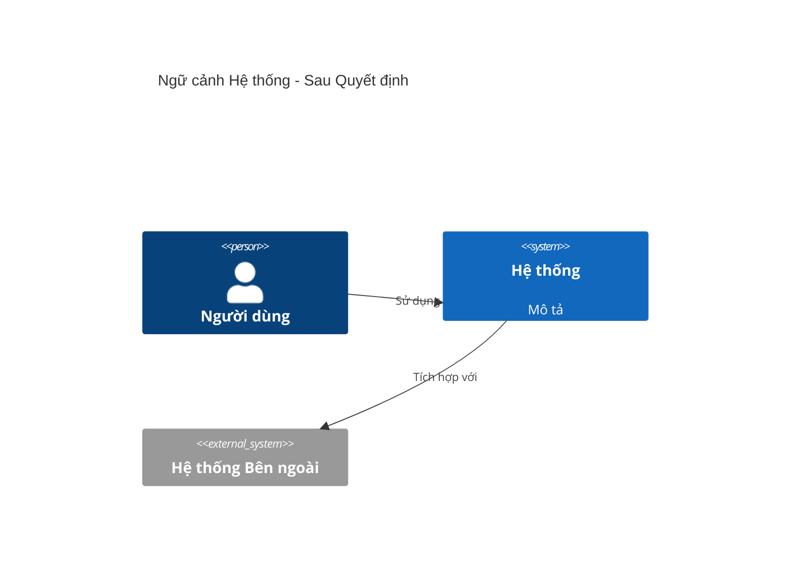
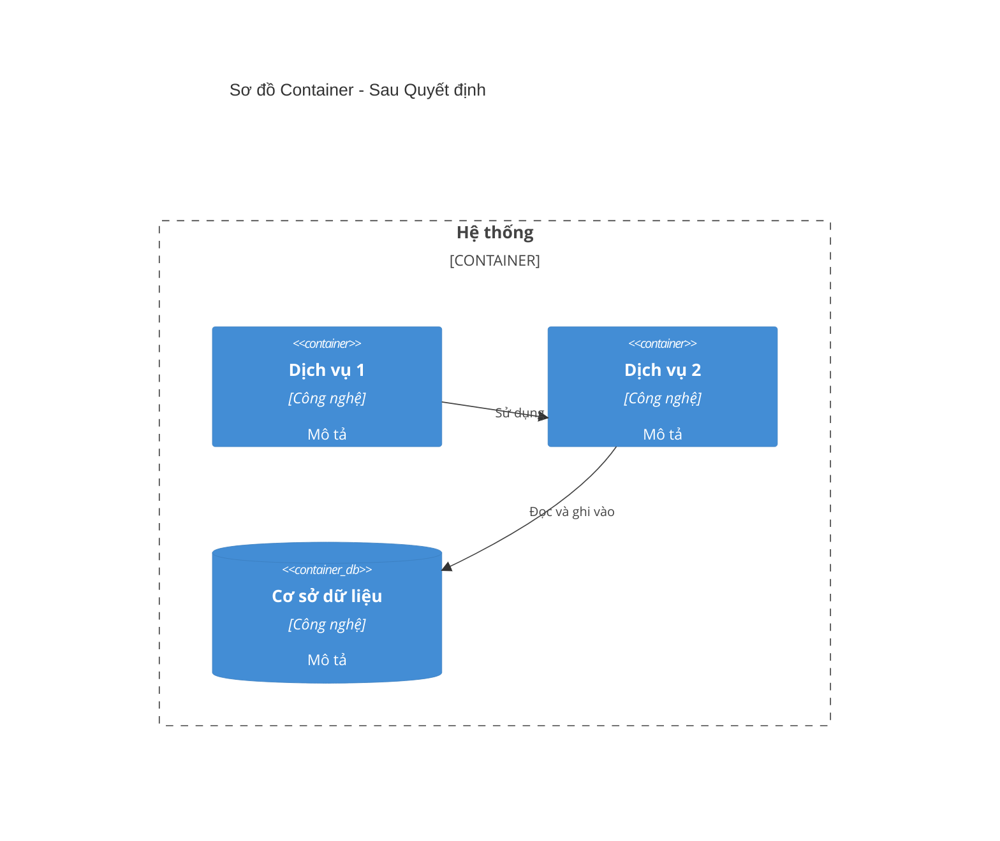
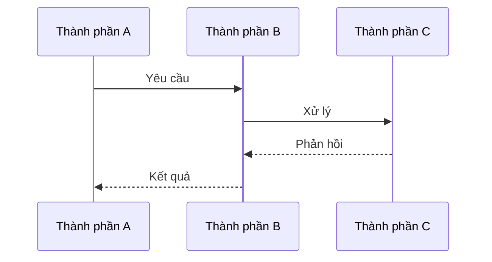
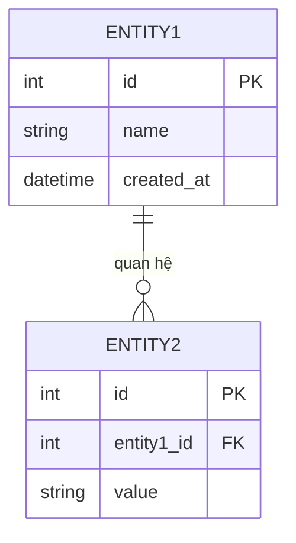

# Template ADR

> **Mục đích**: Template nhẹ cho Bản ghi Quyết định Kiến trúc (ADR)  
> **Định dạng**: Markdown  
> **Phiên bản**: 1.0 (2026)

---

## ADR-XXX: [Tiêu đề Ngắn của Quyết định]

**Trạng thái**: [Đề xuất | Đã chấp nhận | Đã lỗi thời | Đã thay thế]  
**Ngày**: YYYY-MM-DD  
**Người quyết định**: [Tên hoặc vai trò của người quyết định]  
**Tags**: [công nghệ, pattern, dịch vụ, v.v.]

---

## Ngữ cảnh

**Vấn đề hoặc thách thức chúng ta đang gặp phải là gì?**

Mô tả tình huống, ràng buộc và yêu cầu dẫn đến quyết định này. Bao gồm:
- Vấn đề nghiệp vụ hoặc kỹ thuật
- Trạng thái hiện tại và hạn chế
- Yêu cầu phải được giải quyết
- Bất kỳ ràng buộc nào (thời gian, ngân sách, công nghệ, kỹ năng nhóm)

**Ví dụ:**
> Chúng ta cần xử lý 1 triệu người dùng đồng thời với thời gian phản hồi dưới 5 giây. Kiến trúc monolithic hiện tại của chúng ta không thể mở rộng ngang và việc triển khai một tính năng yêu cầu triển khai lại toàn bộ hệ thống.

---

## Quyết định

**Chúng ta đã quyết định gì?**

Nêu rõ quyết định một cách rõ ràng và súc tích. Cụ thể về công nghệ, pattern hoặc cách tiếp cận đã được chọn.

**Ví dụ:**
> Chúng ta sẽ áp dụng kiến trúc microservices với ranh giới dịch vụ dựa trên khả năng nghiệp vụ. Mỗi dịch vụ sẽ có thể triển khai và mở rộng độc lập.

---

## Các Tùy chọn Đã Xem xét

**Những lựa chọn thay thế nào chúng ta đã xem xét?**

Liệt kê các tùy chọn đã được đánh giá, với ưu và nhược điểm ngắn gọn cho mỗi tùy chọn.

### Tùy chọn 1: [Tên Tùy chọn]

**Ưu điểm:**
- Ưu điểm 1
- Ưu điểm 2

**Nhược điểm:**
- Nhược điểm 1
- Nhược điểm 2

### Tùy chọn 2: [Tên Tùy chọn]

**Ưu điểm:**
- Ưu điểm 1
- Ưu điểm 2

**Nhược điểm:**
- Nhược điểm 1
- Nhược điểm 2

### Tùy chọn 3: [Tên Tùy chọn] (nếu áp dụng)

**Ưu điểm:**
- Ưu điểm 1

**Nhược điểm:**
- Nhược điểm 1

---

## Kết quả Quyết định

**Tại sao chúng ta chọn tùy chọn này?**

Giải thích lý do chọn tùy chọn này thay vì các lựa chọn thay thế. Tham chiếu các yêu cầu, ràng buộc hoặc tiêu chí đánh giá cụ thể.

**Ví dụ:**
> Chúng ta chọn microservices vì nó cho phép mở rộng độc lập các dịch vụ dựa trên tải, cho phép đa dạng công nghệ (Go cho các dịch vụ quan trọng về hiệu suất, Node.js cho các dịch vụ thời gian thực), và hỗ trợ chu kỳ triển khai nhanh hơn. Mặc dù nó tăng độ phức tạp vận hành, lợi ích vượt trội so với chi phí cho quy mô và yêu cầu của chúng ta.

---

## Hậu quả

**Những tác động tích cực và tiêu cực của quyết định này là gì?**

### Tích cực

- Lợi ích 1
- Lợi ích 2
- Lợi ích 3

### Tiêu cực

- Đánh đổi 1
- Đánh đổi 2
- Đánh đổi 3

### Trung tính / Ghi chú

- Cân nhắc bổ sung 1
- Ý nghĩa tương lai 2

---

## Tác động Kiến trúc (Tùy chọn)

**Sử dụng phần này khi quyết định thay đổi đáng kể kiến trúc hệ thống.**

### Thay đổi Sơ đồ Ngữ cảnh

**Quyết định này có thay đổi Ngữ cảnh Hệ thống không?** (Tùy chọn)

Nếu quyết định này thêm, xóa hoặc sửa đổi các hệ thống hoặc tác nhân bên ngoài, mô tả các thay đổi ở đây.

**Thay đổi:**
- Đã thêm/xóa/sửa đổi: [Mô tả]

### Thay đổi Sơ đồ Container

**Quyết định này có thay đổi Khung nhìn Container/Logic không?** (Tùy chọn)

Nếu quyết định này thêm, xóa hoặc sửa đổi các container (dịch vụ, cơ sở dữ liệu, v.v.), hiển thị các thay đổi ở đây.

**Thay đổi:**
- Container đã thêm: [Tên Dịch vụ/Cơ sở dữ liệu] - [Lý do]
- Container đã xóa: [Tên Dịch vụ/Cơ sở dữ liệu] - [Lý do]
- Container đã sửa đổi: [Tên Dịch vụ/Cơ sở dữ liệu] - [Thay đổi]

### Thay đổi Luồng Logic

**Quyết định này có thay đổi luồng dữ liệu hoặc luồng quy trình không?** (Tùy chọn)

Nếu quyết định này thay đổi cách dữ liệu hoặc yêu cầu chảy qua hệ thống, tài liệu hóa ở đây.

**Thay đổi:**
- Luồng đã sửa đổi: [Mô tả thay đổi]
- Luồng mới: [Mô tả]

---

## Tác động Mô hình Dữ liệu (Tùy chọn)

**Sử dụng phần này khi quyết định ảnh hưởng đến lược đồ cơ sở dữ liệu hoặc mô hình dữ liệu.**

### Thay đổi ERD

**Quyết định này có thay đổi Sơ đồ Quan hệ Thực thể không?** (Tùy chọn)

Nếu quyết định này thêm, xóa hoặc sửa đổi các bảng, cột hoặc quan hệ cơ sở dữ liệu, tài liệu hóa ở đây.

**Thay đổi:**
- **Bảng Mới**: [Tên bảng] - [Mục đích]
- **Bảng Đã Sửa đổi**: 
  - [Tên bảng]: Đã thêm cột [danh sách], Đã xóa cột [danh sách]
- **Quan hệ Mới**: [Mô tả]
- **Quan hệ Đã Sửa đổi**: [Mô tả]

### Ghi chú Di chuyển Lược đồ

- Vị trí script di chuyển: [Đường dẫn]
- Di chuyển dữ liệu yêu cầu: Có/Không
- Chiến lược hoàn nguyên: [Mô tả]

---

## Tác động Bảo mật (Tùy chọn)

**Sử dụng phần này khi quyết định có ý nghĩa về bảo mật.**

### Phân tích Bảo mật

**Những mối quan ngại bảo mật nào đã được phân tích?**

- **Mối đe dọa**: [Mô tả mối đe dọa bảo mật]
  - **Mức độ Rủi ro**: [Cao | Trung bình | Thấp]
  - **Giảm thiểu**: [Cách nó được giải quyết]

- **Mối đe dọa**: [Mô tả]
  - **Mức độ Rủi ro**: [Cao | Trung bình | Thấp]
  - **Giảm thiểu**: [Cách nó được giải quyết]

### Biện pháp Bảo mật

**Những biện pháp bảo mật nào được triển khai hoặc yêu cầu?**

- Thay đổi Xác thực/Ủy quyền: [Mô tả]
- Mã hóa dữ liệu: [Mô tả]
- Bảo mật mạng: [Mô tả]
- Yêu cầu tuân thủ: [PCI DSS, GDPR, v.v.]
- Kiểm thử bảo mật: [Các kiểm thử yêu cầu]

### Đánh đổi Bảo mật

- **Tích cực**: [Cải thiện bảo mật]
- **Tiêu cực**: [Mối quan ngại hoặc hạn chế bảo mật]

---

## Tác động Hiệu suất (Tùy chọn)

**Sử dụng phần này khi quyết định ảnh hưởng đến hiệu suất hệ thống.**

### Phân tích Hiệu suất

**Quyết định này ảnh hưởng đến hiệu suất như thế nào?**

- **Độ trễ**: [Tác động đến thời gian phản hồi]
  - Trước: [Cơ sở]
  - Sau: [Dự kiến]
  - Thay đổi: [Cải thiện/Suy giảm]

- **Thông lượng**: [Tác động đến yêu cầu mỗi giây]
  - Trước: [Cơ sở]
  - Sau: [Dự kiến]
  - Thay đổi: [Cải thiện/Suy giảm]

- **Sử dụng Tài nguyên**: [CPU, Bộ nhớ, Mạng]
  - Trước: [Cơ sở]
  - Sau: [Dự kiến]
  - Thay đổi: [Tăng/Giảm]

### Tối ưu hóa Hiệu suất

**Những tối ưu hóa nào được triển khai hoặc lên kế hoạch?**

- Chiến lược cache: [Mô tả]
- Tối ưu hóa cơ sở dữ liệu: [Mô tả]
- Tối ưu hóa mạng: [Mô tả]
- Cân bằng tải: [Mô tả]

### Giám sát Hiệu suất

**Những số liệu nào sẽ được giám sát?**

- Số liệu chính: [Danh sách]
- Ngưỡng cảnh báo: [Mô tả]
- Kiểm thử hiệu suất: [Các kiểm thử yêu cầu]

---

## Phụ thuộc & Thư viện (Tùy chọn)

**Sử dụng phần này khi quyết định giới thiệu các phụ thuộc hoặc thư viện mới.**

### Phụ thuộc Mới

**Những phụ thuộc hoặc thư viện mới nào được giới thiệu?**

| Phụ thuộc | Phiên bản | Mục đích | Giấy phép |
|-----------|-----------|----------|-----------|
| tên-thư-viện | 1.0.0 | Mục đích | MIT/Apache/v.v. |
| tên-framework | 2.0.0 | Mục đích | Giấy phép |

### Quản lý Phụ thuộc

- Trình quản lý gói: [npm, Maven, Go modules, v.v.]
- Chiến lược ghim phiên bản: [Chính xác, Phạm vi, Mới nhất]
- Chính sách cập nhật: [Cách các phụ thuộc sẽ được cập nhật]

### Rủi ro Phụ thuộc

- **Bảo mật**: [Lỗ hổng đã biết, tần suất cập nhật]
- **Bảo trì**: [Bảo trì tích cực, hỗ trợ cộng đồng]
- **Giấy phép**: [Tương thích giấy phép, mối quan ngại pháp lý]
- **Kích thước**: [Tác động đến kích thước bundle, thời gian khởi động]

---

## Tác động Triển khai (Tùy chọn)

**Sử dụng phần này khi quyết định ảnh hưởng đến triển khai hoặc hạ tầng.**

### Thay đổi Hạ tầng

**Những thay đổi hạ tầng nào được yêu cầu?**

- **Dịch vụ Mới**: [Danh sách dịch vụ/thành phần mới]
- **Dịch vụ Đã Sửa đổi**: [Danh sách dịch vụ đã sửa đổi]
- **Dịch vụ Đã Xóa**: [Danh sách dịch vụ đã xóa]
- **Thay đổi Cấu hình**: [Biến môi trường, file cấu hình]

### Thay đổi Quy trình Triển khai

**Triển khai thay đổi như thế nào?**

- **Trước**: [Quy trình triển khai hiện tại]
- **Sau**: [Quy trình triển khai mới]
- **Các Bước Di chuyển**: [Các bước để di chuyển]

### Cân nhắc Triển khai

- **Chiến lược Hoàn nguyên**: [Cách hoàn nguyên nếu cần]
- **Không Thời gian Chết**: [Triển khai không thời gian chết có khả thi không?]
- **Di chuyển Cơ sở dữ liệu**: [Các di chuyển yêu cầu]
- **Cờ Tính năng**: [Các cờ tính năng yêu cầu]
- **Giám sát**: [Yêu cầu giám sát mới]

### Yêu cầu Hạ tầng

- **Tính toán**: [CPU, Yêu cầu bộ nhớ]
- **Lưu trữ**: [Yêu cầu lưu trữ]
- **Mạng**: [Yêu cầu mạng, băng thông]
- **Dịch vụ Bên thứ ba**: [Dịch vụ bên ngoài cần thiết]

---

## Ghi chú Triển khai

**Chúng ta sẽ triển khai quyết định này như thế nào?** (Tùy chọn)

- Bước 1 hoặc hướng dẫn
- Bước 2 hoặc hướng dẫn
- Tham chiếu đến tài liệu liên quan

---

## Tham khảo

- [Liên kết đến ADR liên quan](#)
- [Tài nguyên hoặc tài liệu bên ngoài](#)
- [Quyết định hoặc pattern liên quan](#)

---

## Ghi chú

**Ngữ cảnh bổ sung, quyết định theo dõi hoặc thay đổi** (Tùy chọn)

- Ghi chú 1
- Ghi chú 2

---

**Cập nhật lần cuối**: YYYY-MM-DD  
**ADRs Liên quan**: [ADR-XXX](#), [ADR-YYY](#)
