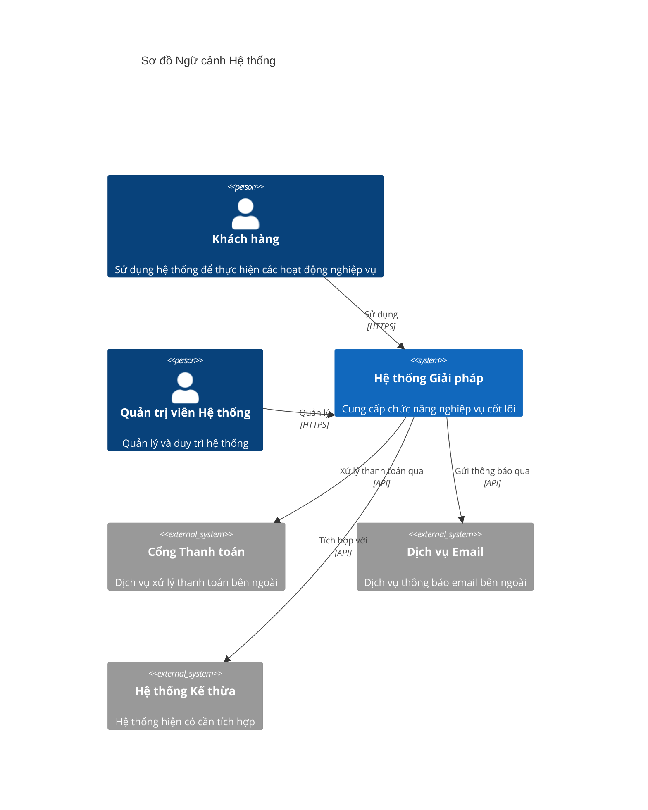
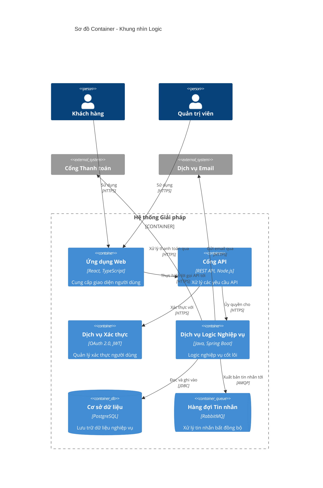
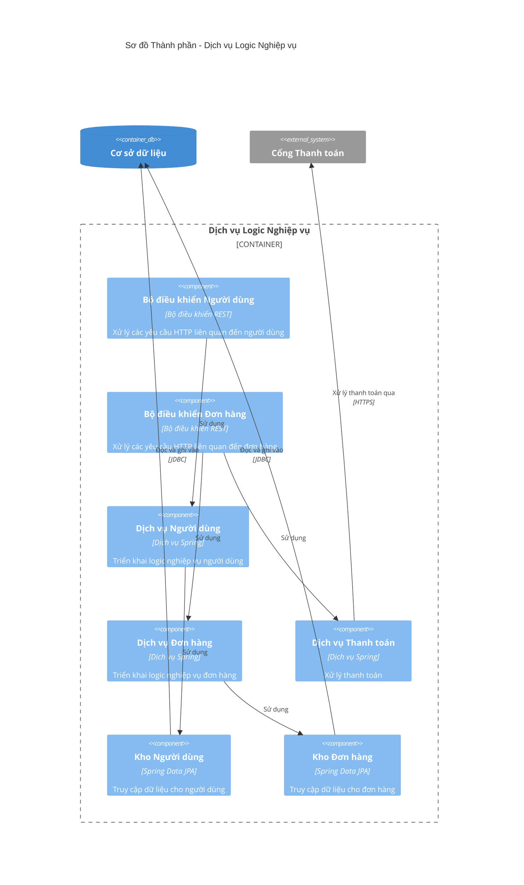
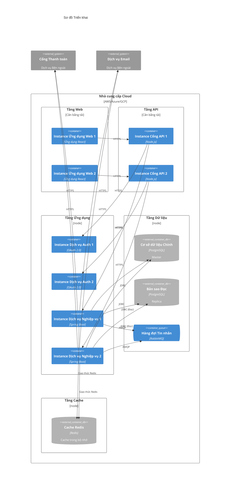
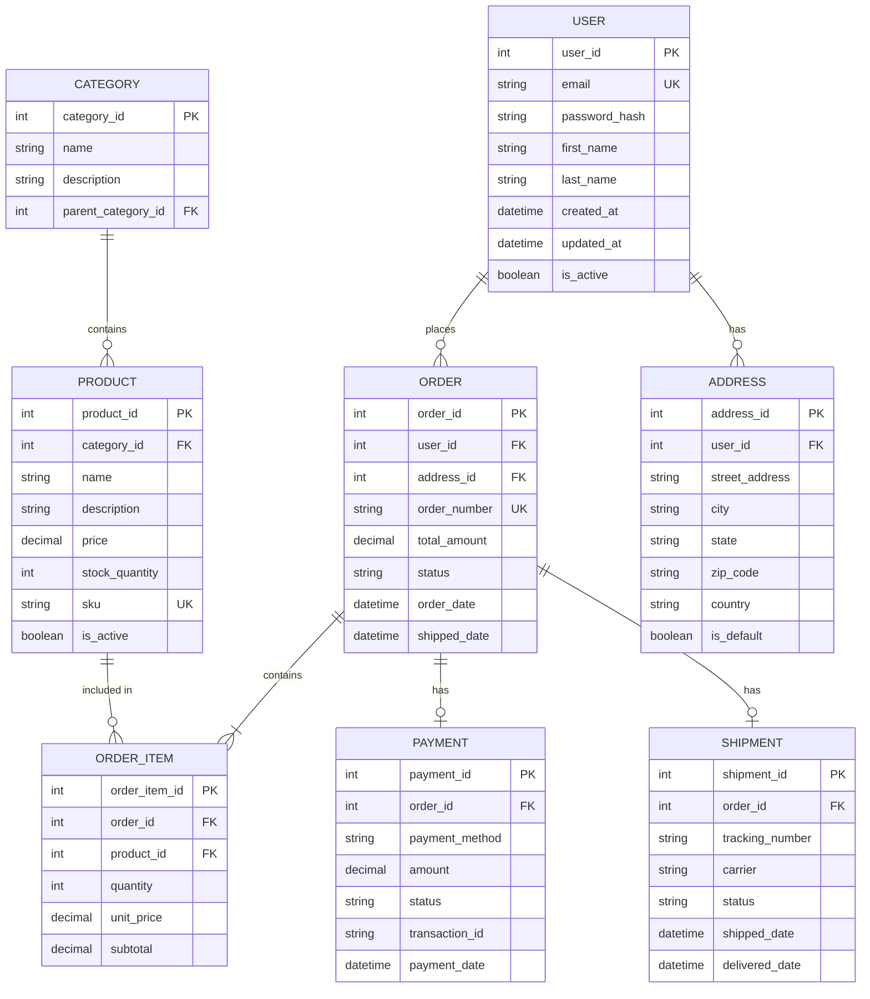
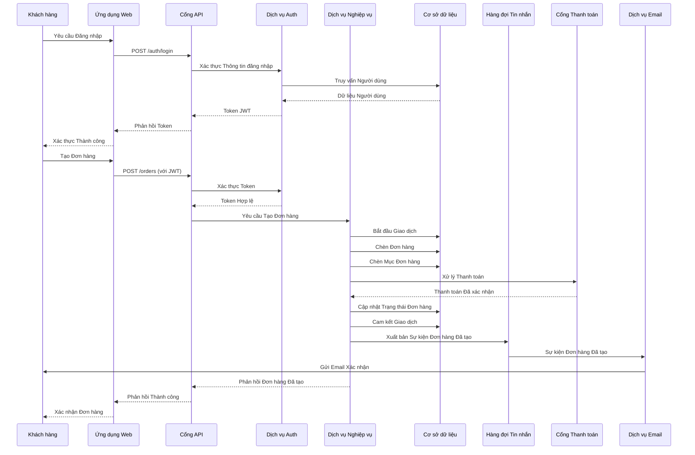

# Template Tài liệu Kiến trúc Giải pháp (SAD)

> **Phiên bản:** 1.0  
> **Cập nhật lần cuối:** 2026  
> **Mục đích:** Template để tài liệu hóa kiến trúc giải pháp sử dụng các thực hành tốt nhất hiện đại

---

## Mục lục

1. [Tóm tắt Điều hành](#1-tóm-tắt-điều-hành)
2. [Tầm nhìn Kiến trúc](#2-tầm-nhìn-kiến-trúc)
3. [Yêu cầu Nghiệp vụ](#3-yêu-cầu-nghiệp-vụ)
4. [Cơ sở Công nghệ](#4-cơ-sở-công-nghệ)
5. [Ngữ cảnh Hệ thống (C4 Cấp 1)](#5-ngữ-cảnh-hệ-thống-c4-cấp-1)
6. [Khung nhìn Logic (C4 Cấp 2 - Container)](#6-khung-nhìn-logic-c4-cấp-2---container)
7. [Khung nhìn Thành phần (C4 Cấp 3)](#7-khung-nhìn-thành-phần-c4-cấp-3)
8. [Khung nhìn Triển khai (C4 Cấp 4)](#8-khung-nhìn-triển-khai-c4-cấp-4)
9. [Kiến trúc Dữ liệu & ERD](#9-kiến-trúc-dữ-liệu--erd)
10. [Tích hợp & Luồng Dữ liệu](#10-tích-hợp--luồng-dữ-liệu)
11. [Kiến trúc Bảo mật](#11-kiến-trúc-bảo-mật)
12. [Yêu cầu Phi Chức năng](#12-yêu-cầu-phi-chức-năng)
13. [Quyết định Kiến trúc](#13-quyết-định-kiến-trúc)
14. [Rủi ro & Giảm thiểu](#14-rủi-ro--giảm-thiểu)

---

## 1. Tóm tắt Điều hành

### 1.1 Mục đích
Tổng quan ngắn gọn về giải pháp, mục tiêu và các bên liên quan chính.

### 1.2 Phạm vi
Xác định những gì được bao gồm và loại trừ khỏi kiến trúc này.

### 1.3 Mục tiêu Chính
- Mục tiêu 1
- Mục tiêu 2
- Mục tiêu 3

### 1.4 Tiêu chí Thành công
- Tiêu chí 1
- Tiêu chí 2
- Tiêu chí 3

---

## 2. Tầm nhìn Kiến trúc

### 2.1 Tuyên bố Tầm nhìn
Tầm nhìn cấp cao mô tả trạng thái tương lai mong muốn của giải pháp.

### 2.2 Nguyên tắc Kiến trúc
- **Nguyên tắc 1**: Mô tả
- **Nguyên tắc 2**: Mô tả
- **Nguyên tắc 3**: Mô tả

### 2.3 Ràng buộc & Giả định
- **Ràng buộc**: Hạn chế kỹ thuật, nghiệp vụ hoặc quy định
- **Giả định**: Các giả định chính về môi trường, người dùng hoặc công nghệ

---

## 3. Yêu cầu Nghiệp vụ

### 3.1 Vấn đề Nghiệp vụ
Mô tả vấn đề nghiệp vụ mà giải pháp này giải quyết.

### 3.2 Mục tiêu Nghiệp vụ
- Mục tiêu 1
- Mục tiêu 2
- Mục tiêu 3

### 3.3 Các bên Liên quan
| Bên liên quan | Vai trò | Mối quan tâm |
|---------------|---------|--------------|
| Bên liên quan 1 | Vai trò | Mối quan tâm |
| Bên liên quan 2 | Vai trò | Mối quan tâm |

### 3.4 Yêu cầu Chức năng
- FR-1: Mô tả yêu cầu
- FR-2: Mô tả yêu cầu
- FR-3: Mô tả yêu cầu

---

## 4. Cơ sở Công nghệ

### 4.1 Trạng thái Hiện tại
Mô tả cảnh quan công nghệ hiện có.

### 4.2 Ngăn xếp Công nghệ
- **Frontend**: Các công nghệ
- **Backend**: Các công nghệ
- **Cơ sở dữ liệu**: Các công nghệ
- **Hạ tầng**: Các công nghệ
- **Tích hợp**: Các công nghệ

### 4.3 Phụ thuộc
- Hệ thống bên ngoài
- Dịch vụ bên thứ ba
- Hệ thống kế thừa

---

## 5. Ngữ cảnh Hệ thống (C4 Cấp 1)

Sơ đồ Ngữ cảnh Hệ thống cung cấp cái nhìn cấp cao nhất của hệ thống, cho thấy cách nó tương tác với người dùng và các hệ thống khác.

### 5.1 Mô tả Hệ thống
Mô tả hệ thống và mục đích của nó.

### 5.2 Hệ thống Bên ngoài
- **Cổng Thanh toán**: Mục đích và phương pháp tích hợp
- **Dịch vụ Email**: Mục đích và phương pháp tích hợp
- **Hệ thống Kế thừa**: Mục đích và phương pháp tích hợp

---

## 6. Khung nhìn Logic (C4 Cấp 2 - Container)

Sơ đồ Container cho thấy các khối xây dựng kỹ thuật cấp cao và cách chúng tương tác.

### 6.1 Mô tả Container

#### 6.1.1 Ứng dụng Web
- **Công nghệ**: React, TypeScript
- **Mục đích**: Lớp giao diện người dùng
- **Trách nhiệm**: 
  - Tương tác người dùng
  - Trình bày dữ liệu
  - Xác thực phía client

#### 6.1.2 Cổng API
- **Công nghệ**: REST API, Node.js
- **Mục đích**: Điều phối và định tuyến API
- **Trách nhiệm**:
  - Định tuyến yêu cầu
  - Giới hạn tốc độ
  - Chuyển đổi yêu cầu/phản hồi

#### 6.1.3 Dịch vụ Xác thực
- **Công nghệ**: OAuth 2.0, JWT
- **Mục đích**: Xác thực và ủy quyền người dùng
- **Trách nhiệm**:
  - Xác thực người dùng
  - Quản lý token
  - Quản lý phiên

#### 6.1.4 Dịch vụ Logic Nghiệp vụ
- **Công nghệ**: Java, Spring Boot
- **Mục đích**: Thực thi logic nghiệp vụ cốt lõi
- **Trách nhiệm**:
  - Thực thi quy tắc nghiệp vụ
  - Xử lý dữ liệu
  - Điều phối tích hợp

#### 6.1.5 Cơ sở dữ liệu
- **Công nghệ**: PostgreSQL
- **Mục đích**: Lưu trữ dữ liệu
- **Trách nhiệm**:
  - Lưu trữ dữ liệu
  - Truy xuất dữ liệu
  - Quản lý giao dịch

#### 6.1.6 Hàng đợi Tin nhắn
- **Công nghệ**: RabbitMQ
- **Mục đích**: Tin nhắn bất đồng bộ
- **Trách nhiệm**:
  - Xếp hàng tin nhắn
  - Phân phối sự kiện
  - Tách rời các dịch vụ

---

## 7. Khung nhìn Thành phần (C4 Cấp 3)

Sơ đồ Thành phần cho thấy cách một container được tạo thành từ các thành phần và mối quan hệ của chúng.

### 7.1 Mô tả Thành phần

#### 7.1.1 Bộ điều khiển
- **Bộ điều khiển Người dùng**: Xử lý các điểm cuối quản lý người dùng
- **Bộ điều khiển Đơn hàng**: Xử lý các điểm cuối quản lý đơn hàng

#### 7.1.2 Dịch vụ
- **Dịch vụ Người dùng**: Triển khai logic nghiệp vụ liên quan đến người dùng
- **Dịch vụ Đơn hàng**: Triển khai logic nghiệp vụ liên quan đến đơn hàng
- **Dịch vụ Thanh toán**: Xử lý logic xử lý thanh toán

#### 7.1.3 Kho
- **Kho Người dùng**: Lớp truy cập dữ liệu cho các thực thể người dùng
- **Kho Đơn hàng**: Lớp truy cập dữ liệu cho các thực thể đơn hàng

---

## 8. Khung nhìn Triển khai (C4 Cấp 4)

Sơ đồ Triển khai cho thấy cách các container được triển khai lên hạ tầng.

### 8.1 Tổng quan Hạ tầng

#### 8.1.1 Tầng Web
- **Instances**: 2+ instances ứng dụng web được cân bằng tải
- **Công nghệ**: Ứng dụng React được phục vụ qua CDN/Web Server
- **Mở rộng**: Mở rộng ngang dựa trên tải

#### 8.1.2 Tầng API
- **Instances**: 2+ instances cổng API được cân bằng tải
- **Công nghệ**: Node.js
- **Mở rộng**: Mở rộng ngang dựa trên khối lượng yêu cầu

#### 8.1.3 Tầng Ứng dụng
- **Dịch vụ Auth**: 2+ instances cho tính khả dụng cao
- **Dịch vụ Nghiệp vụ**: 2+ instances cho tính khả dụng cao
- **Công nghệ**: Microservices Spring Boot
- **Mở rộng**: Mở rộng ngang dựa trên số liệu CPU/bộ nhớ

#### 8.1.4 Tầng Dữ liệu
- **Cơ sở dữ liệu Chính**: Instance master PostgreSQL
- **Bản sao Đọc**: Bản sao PostgreSQL cho các thao tác đọc
- **Hàng đợi Tin nhắn**: Cluster RabbitMQ
- **Chiến lược Sao lưu**: Sao lưu tự động hàng ngày với khôi phục tại thời điểm cụ thể

#### 8.1.5 Tầng Cache
- **Công nghệ**: Redis
- **Mục đích**: Cache trong bộ nhớ để cải thiện hiệu suất
- **Mở rộng**: Cluster Redis cho tính khả dụng cao

### 8.2 Chiến lược Triển khai
- **Triển khai Blue-Green**: Triển khai không thời gian chết
- **Cập nhật Dần dần**: Triển khai dần các phiên bản mới
- **Kiểm tra Sức khỏe**: Giám sát sức khỏe tự động và tự phục hồi

### 8.3 Kiến trúc Mạng
- **VPC**: Cloud riêng ảo để cách ly mạng
- **Subnets**: Subnets công cộng và riêng tư cho bảo mật
- **Cân bằng Tải**: Cân bằng tải ứng dụng để phân phối lưu lượng
- **Nhóm Bảo mật**: Kiểm soát truy cập cấp mạng

---

## 9. Kiến trúc Dữ liệu & ERD

### 9.1 Tổng quan Mô hình Dữ liệu
Mô tả mô hình dữ liệu và các thực thể chính.

### 9.2 Sơ đồ Quan hệ Thực thể (ERD)

### 9.3 Mô tả Thực thể

#### 9.3.1 USER
- **Mục đích**: Lưu trữ thông tin tài khoản người dùng
- **Thuộc tính Chính**: 
  - `user_id`: Khóa chính
  - `email`: Định danh duy nhất để đăng nhập
  - `password_hash`: Mật khẩu được mã hóa
- **Quan hệ**: Một-nhiều với ORDER, một-nhiều với ADDRESS

#### 9.3.2 ORDER
- **Mục đích**: Đại diện cho đơn hàng khách hàng
- **Thuộc tính Chính**:
  - `order_id`: Khóa chính
  - `order_number`: Định danh đơn hàng duy nhất
  - `status`: Trạng thái đơn hàng (chờ xử lý, đang xử lý, đã gửi, đã giao, đã hủy)
- **Quan hệ**: Nhiều-một với USER, một-nhiều với ORDER_ITEM, một-một với PAYMENT, một-một với SHIPMENT

#### 9.3.3 PRODUCT
- **Mục đích**: Thông tin danh mục sản phẩm
- **Thuộc tính Chính**:
  - `product_id`: Khóa chính
  - `sku`: Đơn vị quản lý kho (duy nhất)
  - `price`: Giá sản phẩm
  - `stock_quantity`: Hàng tồn kho có sẵn
- **Quan hệ**: Nhiều-một với CATEGORY, một-nhiều với ORDER_ITEM

#### 9.3.4 CATEGORY
- **Mục đích**: Phân loại sản phẩm
- **Thuộc tính Chính**:
  - `category_id`: Khóa chính
  - `parent_category_id`: Tự tham chiếu cho các danh mục phân cấp
- **Quan hệ**: Một-nhiều với PRODUCT, tự tham chiếu cho các quan hệ cha-con

### 9.4 Chiến lược Lưu trữ Dữ liệu
- **Cơ sở dữ liệu Chính**: PostgreSQL cho dữ liệu giao dịch
- **Cache**: Redis cho dữ liệu được truy cập thường xuyên
- **Sao lưu**: Sao lưu tự động hàng ngày với lưu trữ 30 ngày
- **Lưu trữ**: Chiến lược lưu trữ dữ liệu dài hạn

### 9.5 Luồng Dữ liệu
- **Thao tác Ghi**: Tất cả các ghi đi tới cơ sở dữ liệu chính
- **Thao tác Đọc**: Bản sao đọc cho các thao tác đọc nặng
- **Chiến lược Cache**: Cache dữ liệu được truy cập thường xuyên với TTL

---

## 10. Tích hợp & Luồng Dữ liệu

### 10.1 Kiến trúc Tích hợp

### 10.2 Mẫu Tích hợp
- **REST API**: Giao tiếp đồng bộ giữa các dịch vụ
- **Hàng đợi Tin nhắn**: Giao tiếp bất đồng bộ dựa trên sự kiện
- **Cổng API**: Quản lý và định tuyến API tập trung

### 10.3 Tích hợp Bên ngoài
- **Cổng Thanh toán**: Tích hợp REST API cho xử lý thanh toán
- **Dịch vụ Email**: Tích hợp REST API cho thông báo email
- **Hệ thống Kế thừa**: Tích hợp API cho đồng bộ hóa dữ liệu

---

## 11. Kiến trúc Bảo mật

### 11.1 Nguyên tắc Bảo mật
- **Bảo vệ Nhiều lớp**: Nhiều lớp kiểm soát bảo mật
- **Đặc quyền Tối thiểu**: Quyền truy cập tối thiểu cần thiết
- **Không Tin tưởng**: Xác minh mọi yêu cầu, không tin tưởng ai theo mặc định

### 11.2 Xác thực & Ủy quyền
- **Xác thực**: OAuth 2.0 với token JWT
- **Ủy quyền**: Kiểm soát truy cập dựa trên vai trò (RBAC)
- **Quản lý Token**: Token truy cập thời gian ngắn với token làm mới

### 11.3 Bảo mật Dữ liệu
- **Mã hóa Khi Nghỉ**: Mã hóa cơ sở dữ liệu sử dụng AES-256
- **Mã hóa Khi Truyền**: TLS 1.3 cho tất cả các giao tiếp
- **Bảo vệ PII**: Che giấu và ẩn danh hóa dữ liệu nhạy cảm

### 11.4 Bảo mật Mạng
- **VPC**: Cách ly mạng
- **Nhóm Bảo mật**: Quy tắc tường lửa cho truy cập mạng
- **WAF**: Tường lửa Ứng dụng Web để bảo vệ API
- **Bảo vệ DDoS**: Giảm thiểu Từ chối Dịch vụ Phân tán

### 11.5 Tuân thủ
- **GDPR**: Tuân thủ bảo vệ và quyền riêng tư dữ liệu
- **SOC 2**: Kiểm soát bảo mật và khả dụng
- **PCI DSS**: Bảo mật dữ liệu thẻ thanh toán (nếu áp dụng)

---

## 12. Yêu cầu Phi Chức năng

### 12.1 Hiệu suất
- **Thời gian Phản hồi**: Phản hồi API < 200ms (p95)
- **Thông lượng**: Hỗ trợ 1000 yêu cầu/giây
- **Truy vấn Cơ sở dữ liệu**: Thực thi truy vấn < 100ms (p95)

### 12.2 Khả năng Mở rộng
- **Mở rộng Ngang**: Tự động mở rộng dựa trên số liệu CPU/bộ nhớ
- **Mở rộng Cơ sở dữ liệu**: Bản sao đọc cho khối lượng công việc đọc nặng
- **Cache**: Cache Redis cho dữ liệu được truy cập thường xuyên

### 12.3 Khả dụng
- **Mục tiêu Thời gian Hoạt động**: 99,9% khả dụng (8,76 giờ downtime/năm)
- **Tính Khả dụng Cao**: Triển khai đa AZ
- **Khôi phục Sau Thảm họa**: RTO < 4 giờ, RPO < 1 giờ

### 12.4 Độ tin cậy
- **Xử lý Lỗi**: Xử lý lỗi toàn diện và logic thử lại
- **Ngắt mạch**: Mẫu ngắt mạch cho các lời gọi dịch vụ bên ngoài
- **Kiểm tra Sức khỏe**: Giám sát sức khỏe tự động và tự phục hồi

### 12.5 Khả năng Bảo trì
- **Chất lượng Mã**: Xem xét mã, kiểm thử tự động
- **Tài liệu**: Tài liệu kỹ thuật toàn diện
- **Giám sát**: Giám sát hiệu suất ứng dụng và ghi nhật ký

### 12.6 Khả năng Sử dụng
- **Giao diện Người dùng**: Thiết kế trực quan và phản hồi
- **Khả năng Truy cập**: Tuân thủ WCAG 2.1 AA
- **Hỗ trợ Di động**: Thiết kế phản hồi cho thiết bị di động

---

## 13. Quyết định Kiến trúc

### 13.1 Nhật ký Quyết định

| ID | Quyết định | Trạng thái | Ngày | Lý do |
|----|------------|------------|------|-------|
| ADR-001 | Sử dụng kiến trúc microservices | Đã chấp nhận | 2026-01-01 | Cho phép mở rộng và triển khai độc lập |
| ADR-002 | PostgreSQL làm cơ sở dữ liệu chính | Đã chấp nhận | 2026-01-01 | Tuân thủ ACID, yêu cầu tính nhất quán mạnh |
| ADR-003 | REST API cho giao tiếp đồng bộ | Đã chấp nhận | 2026-01-01 | Giao thức tiêu chuẩn, tích hợp dễ dàng |
| ADR-004 | Hàng đợi tin nhắn cho giao tiếp bất đồng bộ | Đã chấp nhận | 2026-01-01 | Tách rời, khả năng phục hồi cải thiện |
| ADR-005 | OAuth 2.0 cho xác thực | Đã chấp nhận | 2026-01-01 | Tiêu chuẩn ngành, bảo mật, có thể mở rộng |

### 13.2 Quyết định Chính

#### ADR-001: Kiến trúc Microservices
- **Ngữ cảnh**: Nhu cầu mở rộng và triển khai độc lập
- **Quyết định**: Áp dụng kiến trúc microservices
- **Hậu quả**: 
  - ✅ Mở rộng độc lập
  - ✅ Đa dạng công nghệ
  - ❌ Tăng độ phức tạp
  - ❌ Độ trễ mạng

#### ADR-002: Cơ sở dữ liệu PostgreSQL
- **Ngữ cảnh**: Nhu cầu tuân thủ ACID và tính nhất quán mạnh
- **Quyết định**: Sử dụng PostgreSQL làm cơ sở dữ liệu chính
- **Hậu quả**:
  - ✅ Tuân thủ ACID
  - ✅ Tính nhất quán mạnh
  - ✅ Bộ tính năng phong phú
  - ❌ Hạn chế mở rộng dọc

---

## 14. Rủi ro & Giảm thiểu

### 14.1 Rủi ro Kỹ thuật

| Rủi ro | Tác động | Xác suất | Giảm thiểu |
|--------|----------|----------|------------|
| Suy giảm hiệu suất cơ sở dữ liệu | Cao | Trung bình | Bản sao đọc, tối ưu hóa truy vấn, cache |
| Thời gian chết dịch vụ bên ngoài | Cao | Thấp | Ngắt mạch, cơ chế dự phòng, logic thử lại |
| Vi phạm bảo mật | Nghiêm trọng | Thấp | Bảo mật nhiều lớp, kiểm tra thường xuyên, giám sát |

### 14.2 Rủi ro Vận hành

| Rủi ro | Tác động | Xác suất | Giảm thiểu |
|--------|----------|----------|------------|
| Lỗi triển khai | Trung bình | Trung bình | Triển khai blue-green, kiểm thử tự động, quy trình hoàn nguyên |
| Mất dữ liệu | Nghiêm trọng | Thấp | Sao lưu tự động, khôi phục tại thời điểm cụ thể, sao chép |

### 14.3 Rủi ro Nghiệp vụ

| Rủi ro | Tác động | Xác suất | Giảm thiểu |
|--------|----------|----------|------------|
| Mở rộng phạm vi | Trung bình | Cao | Quy trình quản lý thay đổi, liên kết các bên liên quan |
| Ràng buộc tài nguyên | Trung bình | Trung bình | Lập kế hoạch tài nguyên, quản lý công suất |

---

## Phụ lục

### A. Thuật ngữ
- **API**: Giao diện Lập trình Ứng dụng
- **JWT**: Token Web JSON
- **RBAC**: Kiểm soát Truy cập Dựa trên Vai trò
- **VPC**: Cloud Riêng Ảo
- **WAF**: Tường lửa Ứng dụng Web

### B. Tham khảo
- [Mô hình C4](https://c4model.com/)
- [Tài liệu Mermaid](https://mermaid.js.org/)
- [Mô hình Khung nhìn Kiến trúc 4+1](https://en.wikipedia.org/wiki/4%2B1_architectural_view_model)

### C. Lịch sử Tài liệu
| Phiên bản | Ngày | Tác giả | Thay đổi |
|-----------|------|---------|----------|
| 1.0 | 2026-01-26 | Đội Kiến trúc | Template ban đầu |

---

**Trạng thái Tài liệu**: Template  
**Ngày Xem xét Tiếp theo**: Theo nhu cầu  
**Phê duyệt**: Đang chờ
